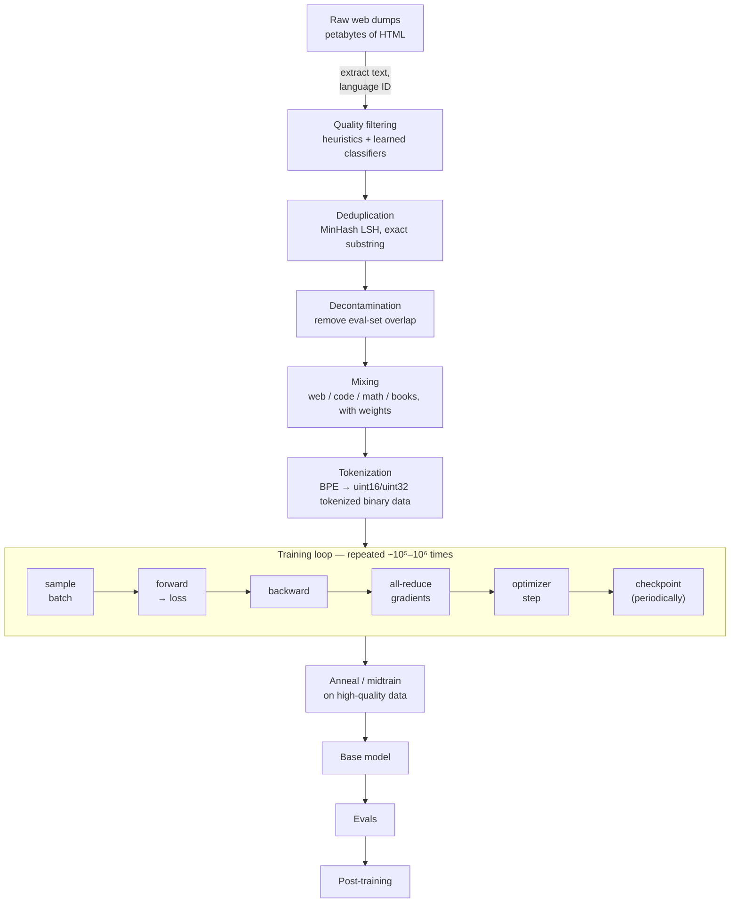
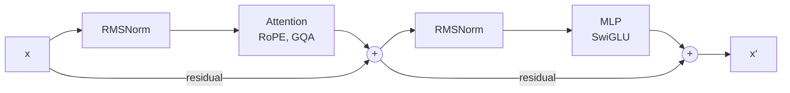
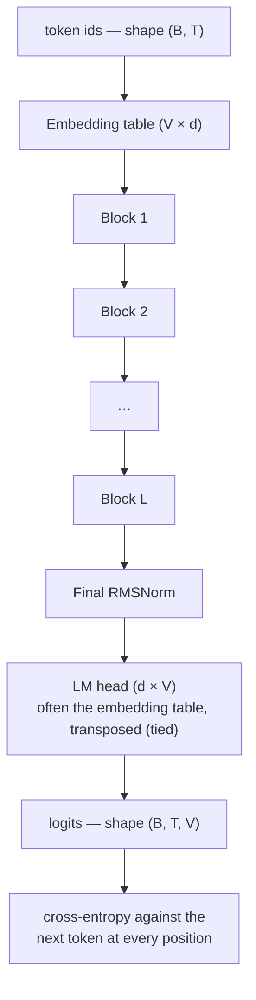
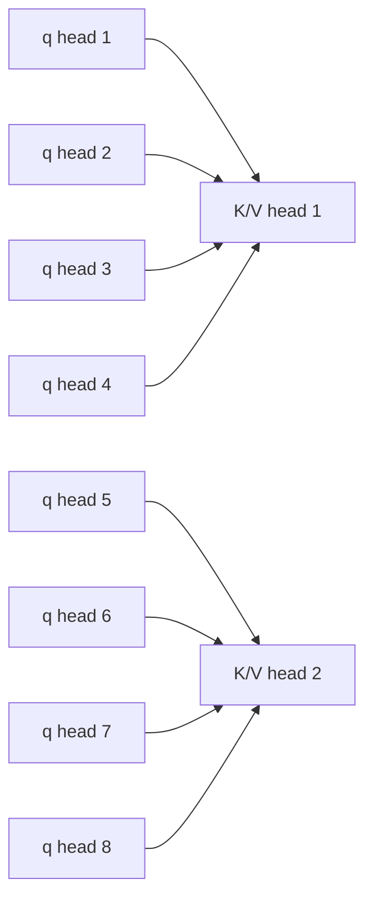
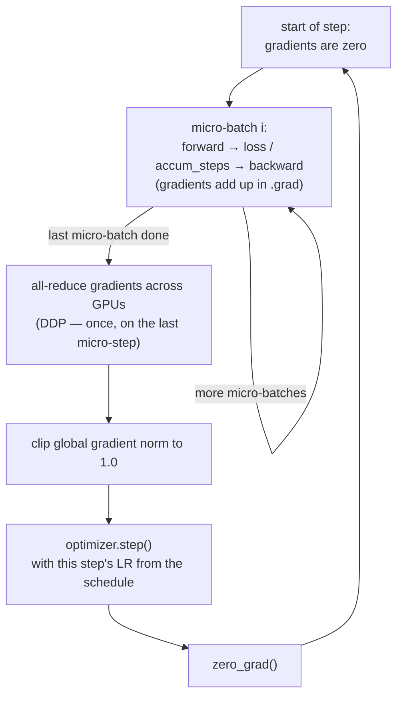
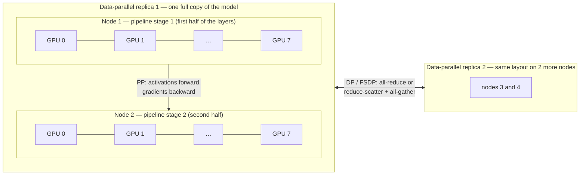
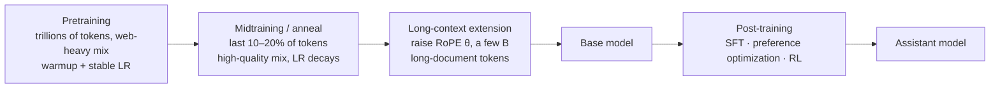
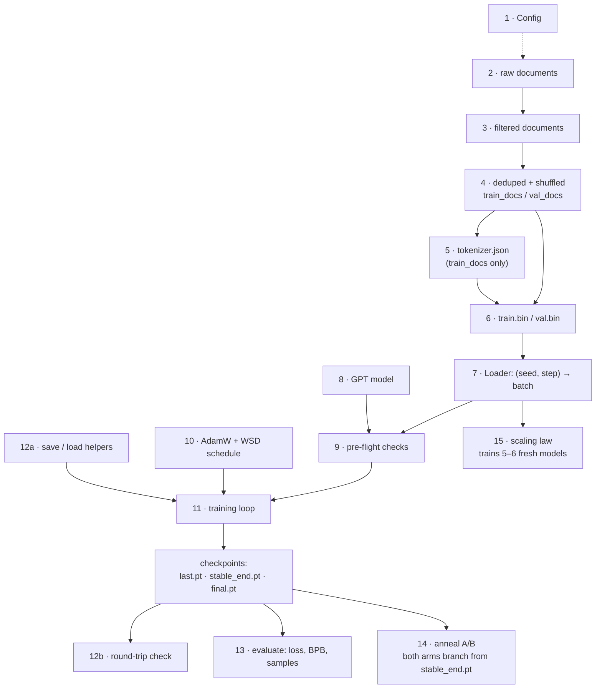

# LLM Pretraining — A Study Guide

[](https://colab.research.google.com/github/adiel2012/llm-pretraining/blob/main/llm-pretraining.ipynb)
 Run [Part 16](#16-the-end-to-end-process--notebook-blueprint) end to end in the
companion notebook, [`llm-pretraining.ipynb`](llm-pretraining.ipynb).

> Pretraining is the phase where a randomly initialized transformer is trained on
> trillions of tokens. For the decoder-only models this guide covers, the primary
> objective is simply: predict the next token. Everything else — instruction
> tuning, RLHF, tool use — builds on what is learned here.

*Scope:* decoder-only causal language models (the GPT / Llama family). Other
pretraining objectives exist — span corruption (T5), denoising, multimodal
objectives — and are out of scope.

**Who this is for:** you can write PyTorch and remember basic linear algebra and
calculus. You do not need prior transformer experience — Part 2 builds it.

**How to use it.** The document has two tracks:

- **The process track — [Part 16](#16-the-end-to-end-process--notebook-blueprint).**
  A linear, runnable walkthrough of the whole pipeline in the order you actually
  execute it, from raw text to a trained, evaluated base model. Every stage is a
  cell in [the Colab notebook](https://colab.research.google.com/github/adiel2012/llm-pretraining/blob/main/llm-pretraining.ipynb).
  **This is the spine — start here.**
- **The reference track — Parts 1–15.** Topic-by-topic depth. Each process stage
  links back to the part that explains *why*. Read these when a stage raises a
  question, or read them straight through first if you prefer theory before
  keyboard.

Parts 1–15 also carry *Checkpoints* — small exercises that are the actual
learning; the prose is scaffolding.

---

## Table of contents

1. [The mental model](#1-the-mental-model)
2. [Prerequisites](#2-prerequisites)
3. [Data](#3-data)
4. [Tokenization](#4-tokenization)
5. [Architecture](#5-architecture)
6. [The objective and the loss](#6-the-objective-and-the-loss)
7. [Optimization](#7-optimization)
8. [Scaling laws](#8-scaling-laws)
9. [Systems and parallelism](#9-systems-and-parallelism)
10. [Stability: when training breaks](#10-stability-when-training-breaks)
11. [Evaluation](#11-evaluation)
12. [The hands-on ladder](#12-the-hands-on-ladder)
13. [After pretraining](#13-after-pretraining)
14. [Reading list](#14-reading-list)
15. [Open-source repositories](#15-open-source-repositories)
16. [**The end-to-end process — notebook blueprint**](#16-the-end-to-end-process--notebook-blueprint)
17. [Glossary](#17-glossary)

---

## 1. The mental model

Hold these five facts in your head; most of the field is elaboration on them.

**1. The objective is trivial.** Given tokens `x₁…xₜ`, predict `xₜ₊₁`. Loss is
cross-entropy, averaged over every position in every sequence. Small auxiliary
terms do appear — z-loss for stability (Part 10), load-balancing losses in MoE
models (Part 5.5) — but they are guard rails. Next-token prediction does the
heavy lifting.

**2. Compute is the currency.** A useful approximation for a dense transformer:

```
C ≈ 6 · N · D        FLOPs
```

where `N` = transformer-body parameters (everything except the token embedding
table and the vocabulary-output projection — "non-embedding" for short, though
that output projection is a matrix, not an embedding table; see the worked
example below), `D` = training tokens. The 6 comes from
2 FLOPs per multiply-accumulate × 3 passes (forward, backward w.r.t. inputs,
backward w.r.t. weights). Every architectural or data decision is really a
question of *how to spend a fixed C*.

**Worked example — where the 6 comes from, and what it costs.** Take one linear
layer `y = x·W` with `W` of shape `d × d`, so `d²` parameters. For one token:

- forward: `d²` multiply-accumulates = `2d²` FLOPs
- backward w.r.t. the input (`∂L/∂x = ∂L/∂y · Wᵀ`): another `2d²`
- backward w.r.t. the weights (`∂L/∂W = xᵀ · ∂L/∂y`): another `2d²`

That is `6d²` = 6 × (its parameters) per token. Most of a large transformer's
compute is such matmuls, so summed over the model it is about `6N` per token and
`6ND` per run.

Treat `6ND` as an approximation for scaling estimates, not an exact FLOP count.
It leaves out the attention-score matmuls (which grow with sequence length), the
LM-head projection, the elementwise work (softmax, norms, activations), and any
recomputation from activation checkpointing. For large models the error is small;
for small models or long contexts it is not ([Part 9.5](#95-mfu--the-number-that-matters)
shows by how much).

Now scale it to Llama-3-8B, trained on 15T tokens. Its "8B" includes the
128,256 × 4,096 input embedding table *and* the same-sized output projection
(the LM head — Llama-3 untied it from the embedding, so it's a second matrix of
that shape, not a second "embedding table"), ~0.5B parameters each. Excluding
both, by this guide's definition, gives `N ≈ 7.0B`:

```
C = 6 × 7.0e9 × 15e12            ≈ 6.3e23 FLOPs
one H100 at 40% MFU              = 0.4 × 989e12 ≈ 4.0e14 FLOP/s
C / 4.0e14                       ≈ 1.6e9 GPU-seconds ≈ 18,000 H100-days
```

About 12 days on a 1,500-GPU cluster. (Using the headline 8B gives ~21,000 —
close enough for a back-of-envelope estimate, but know which convention you're
using.) Checkpoint 1 below asks you to do the same for a different model — do it
without looking back here.

**3. Loss is predictable — empirically.** Loss vs. compute follows a power law across ~6 orders
of magnitude. A *sweep* of small models, trained with one consistent recipe, lets
you forecast the loss of a run far larger than any of them. The forecast is
not a guarantee: the further you extrapolate, the more a change in data, recipe or
batch regime can bend the curve. Still, this is why pretraining is an
engineering discipline and not alchemy — you de-risk at small scale.

**4. Data quality can move the curve, not just the point.** Better data doesn't only
give a lower loss at the same compute; it changes the slope of what you get per
FLOP on downstream tasks. Improvements in data curation, filtering,
deduplication and mixture design have plausibly mattered as much as any single
architectural change (RoPE, GQA, SwiGLU, MoE) to recent open-model progress —
a claim this guide leans on to justify Part 3's length, not a settled measurement.

**5. At scale, the bottleneck is systems.** A 70B-parameter run is a distributed
systems problem — memory hierarchies, collective communication, fault tolerance
over thousands of GPUs for months — wearing a machine learning costume.

### The pipeline, end to end



Parts 3–4 cover everything above the training loop, Parts 5–10 the loop itself,
Part 11 the evals and Part 13 what comes after.

### Checkpoint 1

Without looking: estimate the training FLOPs for a 7B model on 2T tokens. Then
work out roughly how many H100-days that is at 40% MFU. (Peak bf16 on an H100 is
~990 TFLOP/s dense on the SXM variant — the 1,979 on spec sheets assumes 2:4
sparsity — and ~756 TFLOP/s dense on the PCIe variant. Use whichever card you are
pricing.) You should land in the low thousands of GPU-days.

---

## 2. Prerequisites

Don't over-invest here. You need working fluency, not mastery.

| Area | What you actually need | Skip |
|---|---|---|
| Linear algebra | Matmul shapes, why `(B,T,C) @ (C,C)` works, broadcasting | Eigendecompositions, SVD proofs |
| Calculus | Chain rule, what a gradient is | Manual backprop derivations (do it once, then use autograd) |
| Probability | Cross-entropy, KL, softmax as a distribution, perplexity | Measure theory |
| PyTorch | `nn.Module`, autograd, `DataLoader`, `.to(device)`, mixed precision | Custom C++ extensions |
| Systems | What a GPU SM is, HBM vs SRAM bandwidth, what an all-reduce does | CUDA kernel authoring (until Part 9) |

**The one derivation worth doing by hand:** cross-entropy loss of a softmax
output. The gradient w.r.t. the logits is `softmax(z) − y_onehot`. It falls out
in three lines and it explains why training is numerically well-behaved.

**Worked example — one softmax, by hand.** A three-token vocabulary, logits
`z = [2, 1, 0]`, and the correct next token is token 0:

```
exp(z)             = [7.389, 2.718, 1.000]        sum = 11.107
p = softmax(z)     = [0.665, 0.245, 0.090]
loss = −ln p[0]    = −ln 0.665 = 0.408 nats
∂loss/∂z = p − y   = [0.665 − 1, 0.245, 0.090] = [−0.335, 0.245, 0.090]
```

Read the gradient as an instruction: push the correct logit up, and push each
wrong logit down in proportion to the probability it took. The components sum to
zero and each stays within `[−1, 1]` however extreme the logits get. That bounded
gradient *at the output* is one reason softmax + cross-entropy is numerically
convenient. It does not mean gradients stay bounded all the way down a deep
network — they can still explode or vanish on the way back, which is what
normalization, residual connections, careful init and gradient clipping are for
(Parts 5, 7 and 10).

**Fastest path if rusty:** Karpathy's *Neural Networks: Zero to Hero* videos 1–4
(micrograd → makemore → attention). ~8 hours, and you write every line.

### Checkpoint 2

Implement `micrograd` from scratch — a scalar autograd engine in <150 lines.
Verify gradients against PyTorch on a two-layer MLP. If you can do this, you will
never again be confused about what `.backward()` does.

---

## 3. Data

This is the part that is least glamorous and most determines the result. Budget
your learning time accordingly: if architecture gets 20% of your attention, data
should get 40%.

### 3.1 Where tokens come from

| Source | Rough scale | Notes |
|---|---|---|
| Common Crawl | ~100B pages, petabytes of WARC | The base of nearly every open corpus. RefinedWeb's own pipeline removes ~90% of documents — about 50% for non-English language ID, then ~24% of the remainder for quality, ~12% of what's left as duplicates ([Penedo et al., 2023](https://arxiv.org/abs/2306.01116)). |
| Curated web | FineWeb (15T), DCLM-Baseline (4T), RefinedWeb (5T) | Pre-filtered CC derivatives ([FineWeb](https://arxiv.org/abs/2406.17557); [DCLM](https://arxiv.org/abs/2406.11794); [RefinedWeb](https://arxiv.org/abs/2306.01116)). **Start here** — don't re-do CC processing. |
| Code | The Stack v2, GitHub | Adding code to the pretraining mix improved natural-language reasoning by up to 8.2% and world-knowledge tasks by up to 4.2% in controlled ablations at 470M–2.8B params ([Aryabumi et al., 2024](https://arxiv.org/abs/2408.10914)). |
| Math | OpenWebMath, proof corpora, arXiv | Small volume, large measured effect: DeepSeekMath's math-heavy continued pretraining drove major gains on math benchmarks at a few-percent-of-corpus scale ([Shao et al., 2024](https://arxiv.org/abs/2402.03300)). |
| Books / papers | arXiv, PubMed, public-domain books | Long-form coherence, rare vocabulary. |
| Reference | Wikipedia, StackExchange | High quality, tiny; usually upweighted. |
| Synthetic | Model-generated rephrasing, textbooks | Increasingly used in midtraining. Contamination risk. |

### 3.2 Filtering

Two families, used together:

**Heuristic filters** — cheap, interpretable, run first. The canonical sets are
the C4 rules and the Gopher quality rules:

- drop documents that are too short or too long (Gopher: fewer than 50 words or
  more than 100,000 words)
- mean word length outside ~3–10 characters
- symbol-to-word ratio (`#`, `…`) above ~0.1
- too few lines ending in terminal punctuation (a C4-style line rule, not a
  Gopher one; the threshold is a tuning knob — Stage 3 uses 60%)
- stopword count below a floor (catches keyword spam)
- bullet-heavy or ellipsis-heavy documents
- language ID confidence below threshold (fastText `lid.176`)

**Learned classifiers** — a fastText or small-transformer classifier trained to
distinguish "reference-like" text (Wikipedia, well-upvoted forum posts,
instruction data) from raw crawl, then used to keep the top *k*% of documents.
DCLM showed this single choice was worth more than most architecture tuning.

> **Failure mode to internalize:** aggressive quality filtering collapses
> diversity. A classifier trained on Wikipedia-like text will quietly delete
> dialect, informal registers, and niche domains. Check what your filter *removes*,
> not just what it keeps — sample 100 rejected documents and read them.

### 3.3 Deduplication

Duplicated data causes memorization, wasted compute, and degraded loss curves.
Two levels:

- **Fuzzy, document-level:** MinHash + LSH. Shingle each doc into n-grams
  (n≈5–13), hash, keep a signature of ~100–256 permutations, band the signature
  into buckets, treat colliding docs as near-duplicates at a Jaccard threshold
  (~0.7–0.8). Scales to trillions of tokens with MapReduce-style sharding.
- **Exact, substring-level:** suffix-array based removal of repeated spans over
  ~50 tokens. Catches boilerplate that survives doc-level dedup.

**Worked example — what banding actually catches.** Split a MinHash signature
into `b` bands of `r` rows. Two documents with Jaccard similarity `s` match on one
band with probability `sʳ`, so they collide in *at least one* band — and become a
candidate pair — with probability `1 − (1 − sʳ)ᵇ`. For `b = 16, r = 8` (128
permutations, as in the Stage 4 notebook cell):

| Jaccard `s` | P(candidate pair) |
|---|---|
| 0.5 | 6% |
| 0.6 | 24% |
| 0.7 | 61% |
| 0.8 | 95% |
| 0.9 | ~100% |

That S-curve is the whole trick: near-duplicates almost always collide, unrelated
documents almost never do, and you never compare all pairs. The quick formula
`(1/b)^(1/r) ≈ 0.71` marks where the curve is *steepest* — a pair at exactly that
similarity is caught ~64% of the time; the 50% point is ~0.67. More bands with
fewer rows each shift the curve left: more duplicates caught, but more false
candidates to verify.

Also decide *scope*: dedup within a crawl dump, or globally across all dumps?
FineWeb found per-dump dedup outperformed global dedup in their ablations
([Penedo et al., 2024](https://arxiv.org/abs/2406.17557)) — over-deduplication
strips away genuinely useful repeated content (e.g. widely-mirrored reference
text). This is a real, counterintuitive result worth remembering, though it is
one dataset's finding, not a universal law — check it if you change corpora.

### 3.4 Decontamination

Remove training documents that overlap your evaluation sets (n-gram overlap,
typically 13-gram matching against every eval instance). Do this *before* you
report numbers, and report the method. Contamination is the single most common
reason a published eval score is meaningless.

### 3.5 Mixing

You have domain buckets and a token budget. Weights matter:

- Upsample high-quality, low-volume sources (Wikipedia, math) — but epoching the
  same tokens more than ~4 times shows clear diminishing returns and eventually
  hurts, per controlled data-constrained scaling experiments up to 900B tokens
  and 9B parameters ([Muennighoff et al., 2023](https://arxiv.org/abs/2305.16264)).
- Code fraction of ~10–20% is common even for general-purpose models.
- Domain weights can be tuned by proxy: train many small models on candidate
  mixes, fit the loss, extrapolate — this is the DoReMi approach
  ([Xie et al., 2023](https://arxiv.org/abs/2305.10429)).
- The mix usually *changes over training*: more web early, more high-quality and
  domain-specific data in the final anneal phase.

### 3.6 Practical shape of the data pipeline

Tokenized data is stored as flat binary shards of `uint16` (vocab ≤ 65,536 —
IDs `0…65535` fit) or `uint32` above that, concatenated with a document
separator token, then read as a memory-mapped array. A batch is `B` random
offsets into that array, each of
length `T+1`; inputs are `[:-1]`, targets are `[1:]`.

```python
import numpy as np, torch

data = np.memmap("train.bin", dtype=np.uint16, mode="r")

def get_batch(B, T, device):
    ix = torch.randint(len(data) - T - 1, (B,))
    x = torch.stack([torch.from_numpy(data[i:i+T].astype(np.int64)) for i in ix])
    y = torch.stack([torch.from_numpy(data[i+1:i+1+T].astype(np.int64)) for i in ix])
    return x.pin_memory().to(device, non_blocking=True), \
           y.pin_memory().to(device, non_blocking=True)
```

Note what this does *not* do: it doesn't respect document boundaries. Sequences
cross documents. Most large runs accept this (with a separator token and
sometimes an attention mask that blocks cross-document attention — "intra-document"
or "document masking", which measurably improved downstream tasks in controlled
ablations, e.g. +11.6% in-context learning and +9.8% knowledge memorization in
one study — [Zhao et al., 2024](https://arxiv.org/abs/2402.13991)).

### Checkpoint 3

Take 10k documents from FineWeb. Implement: (a) three Gopher heuristic filters,
(b) MinHash dedup at threshold 0.8. Report how many documents each stage removes,
then **read 20 of the removed documents**. Write one paragraph on what your
filters are biased against.

---

## 4. Tokenization

An underrated source of model pathologies.

**Byte-Pair Encoding (BPE)** is the most common family. Start from a base
alphabet, repeatedly merge the most frequent adjacent pair, and stop at a target
vocabulary size. Classic BPE starts from characters; **byte-level BPE** (GPT-2
onward, and what the Part 16 notebook uses) starts from the 256 byte values,
which guarantees no input is ever out of vocabulary. The other common family is
**Unigram** (usually via SentencePiece, e.g. T5): it starts from a large
candidate vocabulary and *prunes* it down, instead of merging up.

**Worked example — four BPE merges.** A toy corpus of word counts:
`low ×5, lower ×2, newest ×6, widest ×3`. Start from single characters and count
adjacent pairs, weighting each by how often its word occurs:

| Step | Most frequent pair | Count | Where it comes from | New token |
|---|---|---|---|---|
| 1 | `e` `s` | 9 | newest (6) + widest (3) | `es` |
| 2 | `es` `t` | 9 | the same two words | `est` |
| 3 | `l` `o` | 7 | low (5) + lower (2) | `lo` |
| 4 | `lo` `w` | 7 | the same two words | `low` |

(Steps 1 and 3 had ties — `s t` also scored 9, `o w` also 7. Tie-breaking is an
implementation detail.) After four merges, `newest` is `n e w est` — 4 tokens
instead of 6 — and `low` is a single token. This demo starts from characters,
as classic BPE does; a production byte-level BPE tokenizer runs the identical
merge procedure starting from bytes instead, tens of thousands of times, and
the ordered list of merges *is* the tokenizer either way. Words it never merged
simply stay split into smaller pieces, which is why nothing is ever out of
vocabulary — bytes guarantee this outright, since every input decomposes into
the 256-symbol base alphabet.

Key decisions:

| Decision | Typical | Why it matters |
|---|---|---|
| Vocab size | 32k–256k | A trade-off, not a free win: a larger vocab means fewer tokens per document, but a bigger embedding/output matrix, more FLOPs per token in the LM head, and rarer per-token updates. Modern models trend larger (128k+). |
| Pre-tokenization regex | GPT-4 style split | Controls whether digits, whitespace and punctuation can merge into words. Number-tokenization scheme measurably affects arithmetic performance — LLaMA and PaLM use single-digit tokens, GPT-3.5/4 use multi-digit tokens, and the choice interacts with reasoning accuracy ([Singh & Strouse, 2024](https://arxiv.org/abs/2402.14903)). |
| Whitespace handling | Leading-space attached | `" the"` and `"the"` are different tokens — a classic source of prompt-sensitivity bugs. |
| Training corpus for the tokenizer | Sample of the real mix | A tokenizer trained mainly on English can make other languages several times more expensive in tokens — up to 15× in one cross-lingual study of production tokenizers ([Petrov et al., 2023](https://arxiv.org/abs/2305.15425)). |
| Special tokens | BOS/EOS/separator, reserved slots | Reserve spare slots up front; adding tokens later means resizing embeddings. |

**Metric to know:** *fertility* = tokens per word (or per byte). Compare
tokenizers by fertility on held-out text from each domain you care about. A
tokenizer with 15% lower fertility on your mix means ~15% fewer tokens for the
same text, so roughly 15% less token-proportional training compute — at a fixed
architecture, and ignoring the vocabulary-dependent cost of a larger
embedding/LM head.

That vocabulary cost is concrete. Training the LM head costs `6·d·V` FLOPs per
token. For the notebook's `small` model (`d = 512`, `V = 16,000`) that is 49M
FLOPs per token, out of ~210M in total. Doubling `V` to 32k adds another 49M —
about 23% more work per token — so it only pays off if it cuts the token count by
more than that. At large `d_model` the head is a much smaller share, which is why
big models can afford 128k+ vocabularies.

> **How tokenization can make arithmetic harder:** with merged multi-digit
> tokens, `1234` might segment as `123`+`4` in one context and `12`+`34` in
> another, so the model never sees a stable place-value representation. Splitting
> digits individually (or in fixed groups of 3) removes that raggedness and
> measurably improves arithmetic. Note the limit of this argument: specific
> failures like `9.11 > 9.9` are *contested* — version-string and date priors in
> the training data are at least as plausible a cause. Tokenization is a real
> contributor to arithmetic difficulty, not a complete explanation of reasoning
> failure.

### Checkpoint 4

Train two BPE tokenizers (use `tokenizers` or `sentencepiece`) at 8k and 48k
vocab on the same 200MB corpus. Compare fertility on English, code, and a
non-English sample. Estimate the training-FLOP difference for a fixed document
set. Then find three inputs where one tokenizer segments in a way that would
obviously hurt the model.

---

## 5. Architecture

Modern autoregressive LLMs such as GPT and Llama are typically decoder-only
transformers — the scope this guide fixed in Part 1. The 2017 design has
accumulated a specific set of changes; learn a *representative modern* stack, then
the history.

### 5.1 The block



Pre-norm (normalize *before* the sublayer, not after) with residual connections
gives the residual stream an uninterrupted identity path from input to output —
each block only *adds* a correction to that stream; nothing overwrites it. That
is a major contributor to stable optimization of deep transformer stacks,
alongside initialization, the learning-rate schedule and normalization details
(Part 7) — it is not the whole story on its own.

The whole model is just that block stacked `L` times between an embedding and an
output projection:



### 5.2 Attention

Self-attention for a single head:

```
Attention(Q,K,V) = softmax( QKᵀ / √d_head + M ) V
```

`M` is the causal mask (`−inf` above the diagonal), which is what makes the model
autoregressive: position `t` sees only `≤ t`.

Variants, in the order they were adopted:

- **MHA** (multi-head): `n_heads` separate Q, K, V projections.
- **MQA** (multi-query): one shared K/V head. Shrinks the KV cache ~`n_heads`×,
  but can degrade quality relative to MHA under the same training
  ([Shazeer, 2019](https://arxiv.org/abs/1911.02150)).
- **GQA** (grouped-query): `n_kv_heads` groups, e.g. 8 KV heads for 64 Q heads.
  An intermediate trade-off between MHA and MQA, and the most common choice in
  open dense models: close to MHA quality at close to MQA cache size
  ([Ainslie et al., 2023](https://arxiv.org/abs/2305.13245)).
- **MLA** (multi-head latent attention, DeepSeek): compress K/V into a
  low-rank latent, cache the latent. DeepSeek reports a smaller cache than GQA
  at better quality ([DeepSeek-AI, 2024](https://arxiv.org/abs/2405.04434)).

The KV cache is an *inference* concern, but it constrains *pretraining*
architecture choices, because you must serve what you train.

GQA in a picture — 8 query heads sharing 2 key/value heads, 4 to a group:



MHA is the case where every query head has its own K/V head; MQA is the case
where all eight share one.

**Worked example — tensor shapes through one attention layer.** The notebook's
`small` preset: batch `B = 24`, sequence `T = 512`, `d_model = 512`, 8 query
heads, 2 KV heads, so `d_head = 512 / 8 = 64`.

```
x                          (24, 512, 512)      B, T, d_model
q = x·W_q, split heads     (24, 8, 512, 64)    B, heads, T, d_head
k = x·W_k,  v = x·W_v      (24, 2, 512, 64)    only 2 KV heads (GQA)
repeat k, v 4×             (24, 8, 512, 64)    each KV head serves 4 query heads
scores = q·kᵀ / √64        (24, 8, 512, 512)   one T × T matrix per head
softmax(scores + M) · v    (24, 8, 512, 64)
merge heads, · W_o         (24, 512, 512)      back onto the residual stream
```

Two numbers worth noticing. The score tensor alone is ~50M entries — ~100 MB in
bf16, *per layer* — and it grows with `T²`. Never building it is exactly what
FlashAttention does (Part 9.4). And at inference the KV cache costs
`2 (K and V) × 8 layers × 2 heads × 64 × 2 bytes = 4 KB` per token of context,
per sequence; with full MHA (8 KV heads) it would be 16 KB. That 4× is the whole
reason GQA exists. The general formula for a batch of `B` sequences of length
`T`:

```
KV-cache bytes = B × T × n_layers × 2 × n_kv_heads × d_head × bytes_per_value
```

Serving 24 sequences of 512 tokens with this model takes `24 × 512 × 4 KB ≈ 50 MB`.
It is tiny here, but the same formula gives many gigabytes for a large model at
long context — that is where the cache, not the weights, limits how many users
one GPU can serve.

The rest of the block, and the output end of the model, in the same style:

```
n2(x)                      (24, 512, 512)
gate = x·W_gate            (24, 512, 1408)     d_ff = 1408
up   = x·W_up              (24, 512, 1408)
silu(gate) ⊙ up · W_down   (24, 512, 512)      back onto the residual stream
... × 8 blocks, then the final norm ...
logits = x·W_head          (24, 512, 16000)    one score per vocabulary entry
cross-entropy vs targets   scalar              averaged over 24 × 512 positions
```

The logits are the largest activation in the model: ~197M entries, ~790 MB in
fp32 (the precision cross-entropy is computed in). With a 128k vocabulary that
grows 8×, which is why production stacks use *fused* linear + cross-entropy
kernels that never materialize the full logit tensor (Part 15.5, Liger-Kernel).

**Positional information.** Vanilla transformers add position embeddings.
Current practice:

- **RoPE** (rotary): rotate Q and K by position-dependent angles, so their dot
  product depends on the two positions only through their *difference* (it still
  depends on the content of Q and K, of course) ([Su et al., 2021](https://arxiv.org/abs/2104.09864)).
  Dominant choice. The `theta` base (10000 originally, often 500k+ for
  long-context models) sets the wavelength range.
- **ALiBi**: a linear distance penalty added to attention scores
  ([Press et al., 2021](https://arxiv.org/abs/2108.12409)). Simple,
  extrapolates well to longer sequences than trained on, but has been
  outperformed by RoPE variants at matched training length in later
  comparisons (e.g. [Kazemnejad et al., 2023](https://arxiv.org/abs/2305.19466)).
- **NoPE**: no positional encoding at all — causal masking alone leaks position.
  Works surprisingly well; appears in hybrid layer schemes.

### 5.3 The MLP

```
SwiGLU(x) = ( Swish(x W_gate) ⊙ (x W_up) ) W_down
```

Gated activations such as SwiGLU/GeGLU commonly outperform plain GELU at a
comparable parameter budget in Shazeer's original ablations
([Shazeer, 2020](https://arxiv.org/abs/2002.05202)), and are the usual choice in
modern LLMs — though not the only good one: `modded-nanogpt`
([Part 15](#15-open-source-repositories)) uses ReLU². Because the gate adds a
third matrix, the hidden dimension is set to `(8/3)·d_model` rounded to a
hardware-friendly multiple, keeping the parameter count comparable to a `4·d_model`
GELU MLP — this is the convention PaLM and Llama use, not a property of SwiGLU
itself.

### 5.4 Normalization

**RMSNorm** is the dominant choice in modern decoder-only LLMs: `x / rms(x) · g`,
no mean subtraction, no bias. Cheaper than LayerNorm and reported as empirically
equivalent by its authors ([Zhang & Sennrich, 2019](https://arxiv.org/abs/1910.07467)).
Related tricks:

- **QK-norm:** normalize Q and K before the dot product. Documented as an
  effective stabilizer at scale in reproduced training-instability studies
  ([Wortsman et al., 2023](https://arxiv.org/abs/2309.14322)); increasingly
  standard.
- **Logit soft-capping / z-loss:** keep output logits from drifting large.
  PaLM's z-loss (`10⁻⁴ · log²Z`) is the widely-cited instance
  ([Chowdhery et al., 2022](https://arxiv.org/abs/2204.02311)).

Biases are generally removed from all linear layers — they cost parameters and
slightly hurt stability.

### 5.5 Mixture of Experts

Replace the MLP with `E` expert MLPs and a router that sends each token to the
top-`k` (typically 1–8, often with a few always-on "shared" experts). The *MLP*
parameters grow by ~`E`× — attention and embeddings are unchanged, so total
parameters grow by less — while FLOPs per token grow by only ~`k`×. You buy
capacity with memory instead of compute.

The hard part is **load balancing** — routers collapse onto a few experts. Two
approaches:

1. An auxiliary balancing loss added to the objective (classic, e.g.
   [Zoph et al., 2022](https://arxiv.org/abs/2202.08906); interferes with the
   language-modeling gradient).
2. Loss-free balancing: a per-expert bias on the routing scores, adjusted
   online to equalize load, introduced with DeepSeek-V3
   ([Wang et al., 2024](https://arxiv.org/abs/2408.15664);
   [DeepSeek-AI, 2024](https://arxiv.org/abs/2412.19437)). Cleaner gradients.

MoE is now standard at frontier scale. Learn dense first — everything about MoE
is a modification of it.

### 5.6 Choosing a shape

For a dense model, given a parameter budget:

- `d_model` and `n_layers` trade off; aspect ratio `d_model / n_layers` around
  100–200 is the well-trodden band.
- `d_head` typically 64 or 128.
- Make the large matmul dimensions (`d_model`, `d_ff`, vocab size) multiples of
  64–128 so tensor cores and tensor parallelism divide cleanly. The exact
  requirement depends on dtype, GPU generation and TP degree; small dimensions
  like `d_head` just need to suit the attention kernel (64 or 128).
- Tied vs. untied input/output embeddings: tying saves `V·d_model` parameters
  and was shown to help small models by Press & Wolf
  ([2016](https://arxiv.org/abs/1608.05859)); large models usually untie, since
  the saving is a shrinking fraction of `N` as `d_model` grows.

Non-embedding parameter count for a dense SwiGLU model:

```
N ≈ n_layers · ( (2 + 2·n_kv_head/n_head)·d_model²  +  3·d_model·d_ff )
```

The attention term is Q and O at full width (`2·d²`) plus K and V shrunk by the
GQA ratio — with MHA (`n_kv_head = n_head`) it reduces to the familiar `4·d²`.
With `d_ff ≈ (8/3)·d_model` the MLP term is `≈ 8·d²`. Embeddings (`V·d_model`,
twice if untied) are excluded by convention, as in [Part 1](#1-the-mental-model).
Still, compute it programmatically — hand formulas drift with architecture.

**Worked example — the notebook's `small` model.** `d_model = 512`, 8 layers,
8 query heads and 2 KV heads, and `d_ff = 1408` (`8/3 × 512 = 1365`, rounded up
to a multiple of 128):

```
attention   (2 + 2·2/8) · 512²    =    655,360
MLP         3 · 512 · 1408        =  2,162,688
per layer                         =  2,818,048
× 8 layers                        = 22.54M   non-embedding parameters
embedding   16,000 · 512          =  8.19M   (tied, so counted once)
```

The MLP is ~77% of every layer. That is typical of dense LLMs, and it is why
Mixture-of-Experts (5.5) targets the MLP rather than attention. The RMSNorm gains
add ~10K more — negligible.

### Checkpoint 5

Implement a decoder-only transformer from scratch in a single file: RMSNorm,
RoPE, GQA, SwiGLU, weight tying, causal masking. Train it on TinyStories until it
produces coherent sentences. ~300 lines. Do **not** copy nanoGPT — write it, then
diff against nanoGPT and understand every difference.

---

## 6. The objective and the loss

```python
logits = model(x)                       # (B, T, V)
loss = F.cross_entropy(
    logits.view(-1, V).float(),         # compute CE in fp32
    y.view(-1),
)
```

Every position contributes a prediction — a `(B, T)` batch gives `B·T` training
signals per forward pass. This density is why language modeling is so
sample-efficient as a pretext task.

**Teacher forcing.** During training the model always conditions on the *true*
prefix, never on its own samples. This creates train/inference mismatch
(exposure bias) — a known and largely tolerated cost.

**Units of loss.** Three ways of saying the same thing:

| Unit | Definition | Use |
|---|---|---|
| Cross-entropy (nats/token) | The raw loss | Training curves |
| Perplexity | `exp(loss)` | Intuition; "effective branching factor" |
| Bits per byte (BPB) | `loss · n_tokens / (ln2 · n_bytes)` | **Comparing across tokenizers** |

> Always compare models with BPB, never raw loss, unless the tokenizers are
> identical. A bigger vocabulary packs more text into each token, so per-token
> loss is mechanically higher even when the model is equally good or better on
> the same underlying text. BPB removes that artifact.

Where the BPB formula comes from. The per-token loss is an *average*, so
multiplying it back by the token count gives the total information the model
needed to encode the text, in nats. Divide by `ln 2` to get bits, and by the byte
count to put it per byte:

```
total NLL (nats)  = loss_per_token × n_tokens
BPB               = total NLL / (ln 2 × n_bytes)
                  = loss_per_token × n_tokens / (ln 2 × n_bytes)
```

`n_tokens` is the only tokenizer-dependent quantity in there, and it cancels the
tokenizer dependence of `loss_per_token`. One bookkeeping rule matters in
practice: the numerator must sum the loss over exactly the tokens whose bytes
are in the denominator. A token stream with injected separators (EOT) has
targets with no bytes, so their loss must be excluded from the sum — averaging
over all targets and then multiplying by a content-token count mixes the two
(Stage 13 does it correctly). Perplexity (`exp(loss_per_token)`) has
no such correction, which is why it cannot compare models with different
tokenizers. BPB is still only fair when both models are evaluated on the *same*
text — it removes the tokenizer from the comparison, not differences in data.

**Worked example — the same loss in three units.** A model with a 16,000-token
vocabulary reaches 1.5 nats/token on validation text that averages 4.2 bytes per
token:

```
uniform-guessing baseline   ln 16000              = 9.68 nats/token
perplexity                  exp(1.5)              = 4.48
bits per byte               1.5 / (ln 2 × 4.2)    = 0.515
```

A perplexity of 4.48 is the *effective branching factor* under the cross-entropy
measure — down from 16,000 at initialization — not a claim that the model's
actual next-token distribution is uniform over ~4.5 tokens; in reality it is
peaked, and 4.48 is `e` to the power of its average entropy. Now a second model
with a 32k vocabulary averages 5 bytes/token and reports a *higher* 1.7
nats/token. Its BPB is `1.7 / (ln 2 × 5) = 0.49` — lower than the first model's
0.515, on this text. Raw loss would have ranked the two models the wrong way
round; BPB is the fairer comparison here, though "fairer" still only means
"controls for the tokenizer on this evaluation text", not "the definitive
verdict on which model is better overall."

**Interpreting the curve.** A healthy run drops very fast for the first ~1% of
steps (learning unigram frequencies), then settles into a near-straight line on a
log-log plot. Deviations from that line are the signal you watch for.

### Checkpoint 6

Compute the loss of a model that outputs the unigram token distribution on your
corpus, and of a uniform model (`ln V`). Your training curve should pass through
the unigram baseline within a few hundred steps. If it doesn't, something is
broken — this is the cheapest sanity check in pretraining.

---

## 7. Optimization

### 7.1 The optimizer

**AdamW** remains the standard baseline for LLM pretraining (newer optimizers are
discussed at the end of this section). Its usual hyperparameters:

```python
optimizer = torch.optim.AdamW(
    param_groups,           # see decay/no-decay split below
    lr=3e-4,                # peak; scale down as model grows
    betas=(0.9, 0.95),      # note: β₂=0.95, not the 0.999 default
    eps=1e-8,
    weight_decay=0.1,
    fused=True,
)
```

- `β₂ = 0.95` (rather than 0.999) shortens the second-moment window from ~1,000
  steps to ~20, so the optimizer adapts faster when gradient scale shifts —
  one reason it's commonly used in large-model training, alongside anecdotal
  reports of fewer loss spikes. It has been the standard LLM setting since
  GPT-3 (Brown et al., 2020).
- **Weight decay applies to matrices, not to norms and biases.** The usual
  implementation splits on `dim >= 2`. Note what that rule actually does:
  `nn.Embedding.weight` is 2-D, so it *is* decayed — nanoGPT and many production
  recipes do exactly this. Whether embeddings should be decayed is genuinely
  unsettled; some recipes exclude them (especially when tied to the LM head).
  Pick one and make your code and your notes agree — the common bug is a comment
  that says "no decay on embeddings" sitting above a rule that decays them.
- Gradient clipping at global norm `1.0`. A strong default that nearly every
  large-scale recipe uses (or replaces with an equivalent stability mechanism),
  and a useful telemetry signal (see Part 10).

Newer optimizers (Muon, Shampoo/SOAP, Lion) show real speedups, especially on
small/medium runs — Muon in particular has become the thing to beat in speedrun
benchmarks. Learn AdamW thoroughly first; it is still the safe default at scale.

### 7.2 Learning rate schedule

Two schedules dominate:

**Cosine decay with warmup** — the classic.
```
lr(t) = lr_peak · t/t_warmup                                  , t < t_warmup
      = lr_min + 0.5(lr_peak − lr_min)(1 + cos(π·progress))   , otherwise
```
Warmup is typically 0.1–2% of total steps (or a fixed ~2000 steps). Decay to
~10% of peak. The catch: the schedule depends on the *total* step count, so you
cannot cleanly extend a run.

**WSD (Warmup–Stable–Decay)** — warm up, hold a constant LR for most of training,
then decay sharply over the last ~10–20%. Advantages: you can stop at any point
by triggering the decay, intermediate checkpoints are reusable, and the decay
phase is a natural place to switch to high-quality data. This is the modern
default for runs whose length isn't fixed in advance.

```
lr │      ┌─────────────────────────┐
   │     /                           \
   │    /                              \___
   └───┴──────────────────────────────────── steps
       warmup        stable            decay
```

**Worked example — the notebook's schedule.** The `small` preset uses
`max_steps = 6000`, `warmup_frac = 0.02`, `decay_frac = 0.20`, a peak of `6e-4`
and a floor of 10% of peak:

| Step | Phase | LR |
|---|---|---|
| 0 | warmup begins (1/120 of peak) | 5.0e-6 |
| 60 | warmup, halfway | 3.05e-4 |
| 120 – 4,799 | stable | 6.0e-4 |
| 5,400 | decay, halfway | 3.3e-4 |
| 5,999 | decay ends | ≈ 6.0e-5 |

Nearly 80% of training happens at a single learning rate. If you decided at step 3,000
to stop early, you would branch from a stable-phase checkpoint and run a short
decay from there — you'd still get a finished model. With cosine, the LR at step
3,000 already depends on having planned for 6,000.

### 7.3 Batch size

Measured in **tokens per optimizer step**, not sequences. Typical: 0.5M–4M
tokens for mid-size models, growing with model size.

- Larger batches → less gradient noise → you can use a higher LR, up to a point.
- Beyond the **critical batch size**, doubling the batch stops buying you a
  proportional reduction in steps; you're burning compute for wall-clock.
- Critical batch size grows as loss falls, which is why some runs ramp batch size
  over training.

**Gradient accumulation** decouples the batch size you want from the memory you
have:

```python
for micro in range(accum_steps):
    x, y = get_batch(...)
    with torch.autocast("cuda", dtype=torch.bfloat16):
        loss = model(x, y) / accum_steps      # ← scale: see the note below
    loss.backward()
torch.nn.utils.clip_grad_norm_(model.parameters(), 1.0)
optimizer.step(); optimizer.zero_grad(set_to_none=True)
```

> **What forgetting `/ accum_steps` actually does.** It is widely said that this
> makes your effective learning rate `accum_steps`× too high. That is true for
> SGD and **false for Adam.** Adam's update is `m / (√v + ε)`; multiply every
> gradient by a constant `c` and, ε aside, you get `cm / √(c²v) = m / √v` —
> unchanged. (Bias correction scales both moments identically, and AdamW's
> weight decay is decoupled from the gradient, so neither breaks this. ε only
> matters when gradients are tiny — and scaling them *up* makes it matter less.) The
> real damage is to *clipping and telemetry*: the gradient norm is inflated `c`×,
> so `clip_grad_norm_(…, 1.0)` fires far more often — on most steps, unless the
> true norm is already below `1/accum_steps`. Clipping rescales each step's
> gradient by a *different* factor, which the moment history then mixes, so the
> clean cancellation above no longer describes the trajectory. Once clipping is
> nearly always active the optimizer is effectively following a fixed-norm direction,
> you have lost clipping as an early-warning signal ([Part 10](#10-stability-when-training-breaks)),
> and your logged grad-norm plot is meaningless. Scale the loss anyway — but know
> which failure you are preventing.

With DDP, disable gradient sync on all but the last micro-step
(`model.no_sync()`) or you pay `accum_steps`× the communication.

One full optimizer step, drawn out:



**Worked example — sizing gradient accumulation.** You want 0.5M tokens per step
(`524,288 = 2¹⁹`) at `seq_len = 1024`, and one GPU fits 16 sequences:

```
tokens per micro-batch   16 × 1024              = 16,384
micro-steps needed       524,288 / 16,384        = 32
on 4 GPUs with DDP       32 / 4                  = 8 micro-steps per GPU
```

Each GPU divides its loss by 8 — its *own* micro-step count — and DDP's
all-reduce averages across the 4 GPUs. The optimizer sees exactly the gradient of
one 0.5M-token batch, whether it was computed on 1 GPU in 32 pieces or on 4 GPUs
in 8.

### 7.4 Initialization

- Normal with `std ≈ 0.02`, or `1/√d_model`.
- Scale residual-output projections (attention out-proj, MLP down-proj) by
  `1/√(2·n_layers)`. This keeps the variance of the residual stream from growing
  with depth and is the difference between a stable and an unstable deep model.
- Embeddings: same small normal init.

### 7.5 Hyperparameter transfer

You cannot tune hyperparameters at target scale. Two strategies:

- **Empirical scaling of HPs:** fit `lr*(N)` from a sweep at several small sizes
  and extrapolate. LR typically decreases roughly as a power of `N`.
- **μP (maximal update parametrization):** reparametrize initialization and
  per-layer learning rates so that the optimal LR is *invariant* to width
  ([Yang et al., 2022](https://arxiv.org/abs/2203.03466)). Tune on a 40M model,
  transfer the LR to a 40B model. Real, used in production, and worth
  understanding even if you don't adopt it.

### Checkpoint 7

On a small model, run a 6-point LR sweep at two widths (e.g. `d_model` 256 and
512). Plot final loss vs. LR. Confirm the optimum shifts with width under
standard parametrization. If you're ambitious, implement μP and confirm it
doesn't.

---

## 8. Scaling laws

### 8.1 The shape of the law

Loss as a function of parameters and data:

```
L(N, D) = E + A/N^α + B/D^β
```

`E` is the irreducible entropy of the text. The two terms are the penalties for
finite model size and finite data. This is the Chinchilla parametric fit; its
published exponents land near `α ≈ 0.34`, `β ≈ 0.28`
([Hoffmann et al., 2022](https://arxiv.org/abs/2203.15556)). An independent
reanalysis of the same underlying data questioned some of the original paper's
confidence intervals and one of its three estimation methods, while broadly
supporting the tokens-scale-with-parameters conclusion
([Besiroglu et al., 2024](https://arxiv.org/abs/2404.10102)) — a good reminder
that even Chinchilla's own numbers carry real uncertainty. The earlier Kaplan et
al. scaling-law paper ([2020](https://arxiv.org/abs/2001.08361)) is worth reading
too, mainly to see why its data-scaling conclusion changed once Chinchilla
controlled learning-rate schedule and tokenizer more carefully.

### 8.2 Chinchilla

Minimize `L(N, D)` subject to `C = 6ND`. The result: **`N` and `D` should scale
in roughly equal proportion**, giving a compute-optimal ratio of about

```
D ≈ 20 · N      tokens per parameter
```

Treat the 20 as an empirical fit, not a constant of nature. It comes from
Chinchilla's particular data, tokenizer and recipe, and later refits on other
setups land at different ratios. It is the right *order of magnitude* to reason
with.

This corrected the earlier Kaplan-era practice of training large models on too
few tokens. GPT-3 ([Brown et al., 2020](https://arxiv.org/abs/2005.14165)) is
the canonical example: 175B parameters on 300B tokens, which is ~1.7 tokens per
parameter — more than 10× under-trained by this criterion.

**Worked example — spending a fixed budget.** Say you have `C = 10²¹` FLOPs. With
the rule of thumb `D = 20N`, `C = 6N · 20N = 120N²`, so `N = √(10²¹ / 120) ≈ 2.9B`
parameters trained on `D ≈ 58B` tokens.

Now check the rule against the fitted law from 8.1, using Chinchilla's published
constants (`E = 1.69, A = 406.4, B = 410.7, α = 0.34, β = 0.28`). Hold `C` fixed and
move `N`; `D` is whatever the budget leaves:

| N | D = C / 6N | tokens/param | predicted loss |
|---|---|---|---|
| 0.5B | 333B | 667 | 2.382 |
| 1.0B | 167B | 167 | 2.340 |
| 1.8B | 91B | 50 | **2.329** (minimum) |
| 3.0B | 56B | 19 | 2.336 |
| 10B | 17B | 1.7 | 2.416 |

Two lessons. First, the bowl is *flat*: everything from 1B to 3B lands within
~0.01 nats of the optimum. That flatness is why training a smaller model on far
more tokens (8.3) costs so little in loss. Second, this particular fit puts the
optimum near 50 tokens/param, not 20 — Chinchilla's own three estimation methods
disagreed, and later refits disagree again. That is exactly why 20 is a rule of
thumb. The last row is GPT-3's ratio: clearly off the bottom of the bowl.

### 8.3 Why most modern models train past Chinchilla-optimal

Chinchilla minimizes *training* compute. Real deployments care about *inference*
compute, which is paid forever — a case formalized for the compute-optimal
frontier by [Hägele et al., 2024](https://arxiv.org/abs/2405.18392) and
[Sardana et al., 2023](https://arxiv.org/abs/2401.00448) (inference-aware
scaling laws). A smaller model trained far past the training-optimal point —
Llama-3-8B saw 15T tokens ([Grattafiori et al., 2024](https://arxiv.org/abs/2407.21783)),
~1,875 tokens per parameter (counting all 8B), about 90× the 20-tokens/param
rule of thumb — is worse per training FLOP but much cheaper to serve. ("90×" is
the tokens-per-parameter ratio, not 90× the compute.)

It helps to separate three different questions people call "optimal":

- **Training-compute optimal** — the lowest loss for a fixed training budget
  `C = 6ND`. This is what Chinchilla answers.
- **Inference-aware optimal** — the lowest *total* cost of training the model
  *plus* serving it for its expected lifetime of queries. Heavy expected usage
  pushes toward smaller `N` and larger `D` — i.e. overtraining.
- **Data-constrained optimal** — the best use of compute when you have fewer
  unique tokens than `D` calls for, so you must repeat data (Part 3.5's ~4 epochs).

**The practical rule:** use Chinchilla to reason about what a *fixed training
budget* buys. Use inference economics to choose the actual model size. They are
different questions.

### 8.4 How to actually use scaling laws

1. Pick 5–8 model sizes spanning ~2 orders of magnitude (e.g. 20M → 1B).
2. Train each on a compute-matched budget with a consistent recipe.
3. Fit the power law; check the residuals.
4. Extrapolate to your target — and **predict the target loss before you launch**.
5. If the real run departs from the prediction, investigate — it may be a bug,
   or a genuine change in regime your small runs could not see. Either way this
   is your primary early-warning system on a run that costs six figures.

Scaling laws also work for comparing *data mixes* and *architectures*: fit a
curve for each candidate and compare slopes, not single points. A recipe that
wins at 100M can lose at 10B.

### Checkpoint 8

Train 5 models from ~2M to ~50M parameters on a fixed tokens-per-param ratio.
Fit `L = E + A/N^α`. Then train a 6th model ~3× larger than your biggest and
check whether your fit predicted its loss to within a few percent.

---

## 9. Systems and parallelism

### 9.1 The memory budget

One common setup for a dense model trained with AdamW and bf16 mixed precision
(the exact number depends on the recipe — see the note below the table), per
parameter:

| Item | Bytes/param |
|---|---|
| bf16 weights | 2 |
| fp32 master weights | 4 |
| fp32 gradients | 4 |
| Adam `m` (fp32) | 4 |
| Adam `v` (fp32) | 4 |
| **Total** | **~18** |

You will also see **16 bytes/param** quoted (e.g. in the ZeRO paper): that
convention keeps gradients in bf16 (2 bytes) rather than fp32. PyTorch autocast —
what the Part 16 notebook uses — also lands at 16, but differently: it keeps a
single fp32 copy of the weights and casts to bf16 on the fly, so there is no
separate bf16 weight copy. Other optimizers and sharding schemes give anything
from ~12 to 18+. Check which setup a source is using before comparing numbers.

Plus activations, which scale with `batch × seq_len × d_model × n_layers`, and at
long context can dwarf everything else.

Under the 18-byte setup above, a 7B model needs ~126 GB for states alone (~112 GB
at 16 bytes) — already past a single 80GB
GPU before a single activation is stored. **This is why parallelism exists.**

### 9.2 Mixed precision

Compute in **bf16** (wide exponent, no loss scaling needed — unlike fp16) and
accumulate matmuls in fp32. Keep the weights the optimizer updates in fp32 —
either as a separate master copy or, with autocast, as the only copy (the recipes
differ; see 9.1). Keep the final logits and the cross-entropy in fp32. fp8 training is now in production at frontier labs
(DeepSeek-V3 trained the bulk of GEMMs in fp8) but requires careful per-block
scaling; treat it as advanced.

### 9.3 The parallelism dimensions

| Kind | Splits | Communicates | Use when |
|---|---|---|---|
| **Data (DDP)** | the batch | gradients (all-reduce, once per step) | Always, as the outer dimension |
| **ZeRO / FSDP** | optimizer states, grads, params across DP ranks | params (all-gather) + grads (reduce-scatter) | Model doesn't fit; the default way to scale |
| **Tensor (TP)** | individual weight matrices (attention QKV/out, MLP up/down) across GPUs | activations via all-reduce inside every layer — twice per layer forward, twice backward | Within a node. It is on the critical path of every layer, so it needs NVLink-class bandwidth; across the inter-node network it is too slow |
| **Pipeline (PP)** | layers into stages (e.g. layers 1–8 on GPU 0, 9–16 on GPU 1) | point-to-point sends: activations forward, gradients backward, only at stage boundaries | Across nodes, where bandwidth can't sustain TP; introduces "bubble" idle time |
| **Sequence / Context** | the sequence dimension | attention K/V (ring attention) | Long context |
| **Expert (EP)** | MoE experts | all-to-all token routing | MoE models |

Real frontier runs combine 4–5 of these ("5D parallelism"). The standard layout
is TP within a node, PP across a small group of nodes, DP/FSDP across everything
else. For a model split into two pipeline stages, that looks like this:



Inside each node, the 8 GPUs split every weight matrix between them (TP, over
NVLink). The lines between GPUs are that TP group; the arrows are the slower
links between nodes.

**ZeRO stages** ([Rajbhandari et al., 2019](https://arxiv.org/abs/1910.02054)),
worth knowing precisely:
- Stage 1: shard optimizer states across the data-parallel ranks. Optimizer
  memory shrinks in proportion to the number of ranks. Total model-state memory
  shrinks less: the ZeRO paper quotes ~4× at large data-parallel degree under its
  16-byte accounting, closer to ~3× with the 18-byte table above. Same
  communication volume as plain DDP.
- Stage 2: also shard gradients.
- Stage 3 (≈ FSDP's full-shard mode): also shard parameters; gather them
  just-in-time per layer. Maximum savings, most communication. (FSDP also has
  a mode that shards only gradients and optimizer states — roughly Stage 2.)

**Worked example — a 7B model on one 8-GPU node.** Take the 18-byte budget from
9.1 apart: 2 bytes of bf16 weights, 4 of fp32 gradients, and 12 of optimizer
state (fp32 master copy + Adam `m` + Adam `v`). With 8 data-parallel GPUs, here
is what *each* GPU holds:

| Scheme | Split 8 ways | Bytes/param per GPU | Per GPU, 7B model |
|---|---|---|---|
| DDP | nothing | 18 | 126 GB |
| ZeRO-1 | optimizer state (12) | 2 + 4 + 12/8 = 7.5 | 52.5 GB |
| ZeRO-2 | + gradients (4) | 2 + (4 + 12)/8 = 4 | 28 GB |
| ZeRO-3 / FSDP | + weights (2) | 18/8 = 2.25 | 15.8 GB |

On 80 GB GPUs, plain DDP doesn't fit at all. ZeRO-1 fits with ~27 GB left for
activations; ZeRO-3 leaves ~64 GB. Each stage buys memory with communication:
ZeRO-3 has to all-gather every layer's weights before using them.

### 9.4 Making it fast

- **FlashAttention** — compute attention in tiles that fit in SRAM, never
  materializing the `T×T` matrix. Turns attention memory from `O(T²)` to `O(T)`
  and is substantially faster ([Dao et al., 2022](https://arxiv.org/abs/2205.14135)).
  Use it (via `F.scaled_dot_product_attention` or the `flash-attn` package);
  never hand-roll attention for a real run.
- **Activation checkpointing** — discard activations in the forward pass,
  recompute them in the backward. Trades extra recomputation for much lower
  activation memory. Checkpointing everything costs roughly one extra forward
  pass (about +33% compute, since the forward is ~⅓ of forward + backward).
  Selective checkpointing — recomputing only the parts that are memory-heavy but
  cheap to redo, like the attention softmax — gets most of the memory saving for
  a small fraction of that extra compute
  ([Korthikanti et al., 2022](https://arxiv.org/abs/2205.05198)).
- **`torch.compile`** — fuses operations and cuts Python and kernel-launch
  overhead. Speedups are workload- and hardware-dependent (tens of percent is
  common), and not free: compile time at startup, recompiles when shapes change,
  and graph breaks that are harder to debug than eager code.
- **Overlap communication with compute** — FSDP prefetching, gradient bucketing.
  Without overlap, comms can be 30%+ of step time.

### 9.5 MFU — the number that matters

```
MFU = (6 · N · tokens_per_second) / (n_gpus · peak_FLOPs_per_gpu)
```

Interpretation: what fraction of your hardware's theoretical peak you are
actually converting into model FLOPs.

`6N` counts only the parameter matmuls, which is accurate for large models. It
undercounts when other FLOPs are a big share: the LM-head projection (`6·V·d`
per token, left out of non-embedding `N`) and attention's `QKᵀ`/`AV` (roughly
`12·n_layer·d_model·seq_len` per token, which grows with context). For small
models or long sequences, add both terms — the Stage 11 notebook does.

This makes published MFU numbers only loosely comparable: some use bare `6N`,
PaLM's original definition adds the attention term
([Chowdhery et al., 2022](https://arxiv.org/abs/2204.02311)), and some count the
LM head. When you compare against a paper, use *its* formula — which is why
Stage 11 logs both the bare `6N` figure and the fuller estimate.

**Worked example — MFU for the notebook's `small` run on an A100.** Say the log
shows 300k tokens/s against the A100's 312 TFLOP/s bf16 peak:

```
bare 6N         6 × 22.54M                               = 135M FLOPs/token
fuller          6 × (22.54M + 8.19M LM head)
                  + 12 × 8 × 512 × 512 (attention)       = 210M FLOPs/token

MFU (6N)        135M × 300k / 312e12                     = 13%
MFU (fuller)    210M × 300k / 312e12                     = 20%
```

Same run, same speed: 13% or 20%, depending on what you count. At this size the
LM head and attention are over a third of the real work. On a 70B model at 4k
context the two figures differ by under 10%.

**On large, well-shaped training workloads, 35–55% is good.** Below ~25% on such
a workload usually means a fixable problem — dataloading, missing overlap,
unfused kernels, or bad shapes. Small models are different: at the Part 16
notebook's size, 15–25% is normal, because kernel-launch overhead dominates.
Expected MFU depends on model size, sequence length, hardware and parallelism,
so compare against runs like yours. It should be on your dashboard from step one.

### 9.6 Fault tolerance

At 1000+ GPUs for months, hardware *will* fail — during one 54-day snapshot of
the Llama-3-405B run, Meta recorded 419 unexpected interruptions, ~78% attributed
to confirmed or suspected hardware issues (GPUs alone accounted for ~58.7% of
all interruptions) ([Grattafiori et al., 2024](https://arxiv.org/abs/2407.21783)).
Requirements:

- Checkpoint frequently and asynchronously (write to local NVMe, upload in
  background).
- Save model, optimizer, LR schedule, **and dataloader position**. Forgetting
  the dataloader state means silently re-training on the same tokens.
- Automatic restart from last checkpoint with node replacement.
- Detect stragglers and silent data corruption (a single flaky GPU producing bad
  gradients can poison a run for hours before it shows in the loss).

### Checkpoint 9

Take your Part 5 model. Measure MFU on one GPU. Then: enable `torch.compile`,
swap in FlashAttention, tune batch size, and fix the dataloader. Record MFU after
each change. Then scale to 2 GPUs with DDP and verify the loss curve matches the
1-GPU run at the same token count.

---

## 10. Stability: when training breaks

The characteristic failure of a large pretraining run is a **loss spike** — the
loss jumps by 0.5–3 nats and either recovers over thousands of steps or diverges.

**Leading indicators**, all of which you should be logging:

- gradient norm (pre-clip) — spikes here precede loss spikes
- fraction of steps being clipped
- per-layer activation RMS and max
- attention logit maximum (the classic culprit: attention logits growing until
  softmax saturates)
- output logit magnitude
- Adam second-moment `v` distribution
- parameter update / parameter magnitude ratio (should sit near `10⁻³`)

**Preventive measures**, roughly in order of adoption:

| Measure | What it does |
|---|---|
| QK-norm | Bounds attention logits directly. Reproduced as a very effective, cheap stabilizer in controlled small-scale instability studies ([Wortsman et al., 2023](https://arxiv.org/abs/2309.14322)). |
| z-loss (`10⁻⁴ · log²Z`) | Keeps the softmax normalizer near 1, preventing logit drift. PaLM's own coefficient ([Chowdhery et al., 2022](https://arxiv.org/abs/2204.02311)). |
| Lower `β₂` (0.95) | Faster adaptation to gradient-scale changes. |
| Tuning Adam `eps` | Two *opposite* adjustments exist and get confused. **Raising** eps (say 1e-8 → 1e-6) damps updates when `v` is tiny, guarding against huge steps on near-zero gradients. **Lowering** it (as low as 1e-15 for some large models) prevents a specific failure Wortsman et al. document directly: at high learning rate and scale, activation RMS grows through the network, which shrinks the *incoming* gradient at each LayerNorm/RMSNorm in proportion — once that gradient RMS approaches `eps`, the update magnitude collapses and learning stalls, even though nothing has diverged. Know which problem you have before changing it. |
| Residual-scaled init | Keeps deep residual streams bounded. |
| Longer warmup | Cheapest fix for early-training instability. |
| Embedding norm / logit soft-cap | Bounds the two ends of the network. |

**When a spike happens anyway:** the standard playbook, as PaLM describes it, is
to rewind to a checkpoint ~100 steps before the spike, skip the next 200–500 data
batches, and resume
([Chowdhery et al., 2022](https://arxiv.org/abs/2204.02311)). PaLM's own
finding, worth knowing so you don't over-fit the story: they saw spikes even
with clipping enabled, at irregular intervals, and traced them to specific data
batches combined with a particular model state — not to a single class of "bad
document" they could filter out in advance.

> **Debugging heuristic:** if the loss diverges immediately, it's your LR or
> init. If it diverges after hours of healthy training, it's data or numerics.
> If loss sits at exactly `ln V` and never moves, **no learning is happening at
> all** — LR is 0, the optimizer was handed the wrong parameter list,
> `zero_grad()` runs after `backward()` instead of after `step()`, or the graph
> is detached. Note what this is *not*: misaligned labels still let the model fit
> unigram frequencies, so a shifted-target bug drops the loss below `ln V` and
> then stalls at a visibly-too-high plateau. Flat-at-`ln V` means dead, not
> misaligned.

### Checkpoint 10

Deliberately break your training run four ways: (1) LR 30× too high, (2) no
residual init scaling at 24 layers, (3) shift targets by one extra position,
(4) inject a document of 50k repeated `"a"` tokens. Record the loss curve and
grad-norm signature of each. You are building a diagnostic vocabulary — these
four shapes cover most real failures.

---

## 11. Evaluation

Base models are evaluated differently from chat models. They cannot follow
instructions; you evaluate them by likelihood and few-shot completion.

### 11.1 Loss-based

The most reliable signal during training. Held-out **bits-per-byte** on each
domain you care about (web, code, math, books, and any target domain). Low
variance, immediately interpretable, no prompt sensitivity. Track a per-domain
panel, not one aggregate number.

### 11.2 Benchmarks

Scored by comparing the model's likelihood of each answer option, usually with
few-shot prompting:

| Benchmark | Measures | Note |
|---|---|---|
| HellaSwag | Commonsense completion | Smooth and early-signal; good for small models |
| ARC-Easy/Challenge | Science QA | |
| PIQA, WinoGrande | Physical/coreference commonsense | |
| MMLU | 57-subject knowledge | Historically near-random below ~7B params, but that threshold has moved a long way down — well-trained 0.5–2B models now score far above chance. Still noisy at *your* notebook scale. |
| GSM8K, MATH | Math reasoning | Needs generation. Weak in small base models, but modern small models with math-heavy pretraining are no longer at zero. |
| HumanEval, MBPP | Code | |

**Scoring detail that matters:** normalize option likelihood by token count or
by unconditional likelihood, or you systematically favor short answers. Different
harnesses make different choices, which is why "the same model" scores differently
across leaderboards. Use a single harness — `lm-evaluation-harness`
([Gao et al., 2024](https://doi.org/10.5281/zenodo.10256836)) is the de facto
standard — and report its settings, or use a fixed-format recipe like OLMES
([Gu et al., 2024](https://arxiv.org/abs/2406.08446)) that removes the choice
for you.

**Worked example — the normalization choice decides the answer.** Prompt: *"The
capital of France is"*. Illustrative scores for two options:

| Option | Tokens | Total log-prob | Per-token log-prob |
|---|---|---|---|
| `" Paris"` | 1 | −1.2 | −1.2 |
| `" the city of Paris"` | 4 | −3.2 | −0.8 |

Rank by total log-prob and `" Paris"` wins; rank by per-token average and the
long option wins. Both options are "correct" here, but in a multiple-choice
benchmark only one is — so the same model scores differently under two harness
settings without a single weight changing.

### 11.3 Traps

- **Contamination.** Re-check after every data change, not once.
- **Small-model noise.** At the scale you can train in a notebook (tens of
  millions of parameters), multiple-choice benchmarks are pure noise. Don't steer
  a recipe on them; use loss.
- **Eval on the anneal.** Benchmark scores move a lot during the final decay
  phase. Mid-run scores under-predict final scores.
- **Prompt-format sensitivity.** Base models can swing several points on
  formatting alone. Fix the format and never change it mid-project.

### Checkpoint 11

Run `lm-evaluation-harness` on two public base models of different sizes (e.g.
Pythia-160M and Pythia-1.4B — same data, same order, 154 published checkpoints
each, [Biderman et al., 2023](https://arxiv.org/abs/2304.01373)). Reproduce the
published HellaSwag numbers. Then
change the few-shot count and the normalization and see how much you can move
the score without touching the model.

---

## 12. The hands-on ladder

Each rung is a complete, finishable project. Don't skip; each one teaches
something the next assumes.

> **[Part 16](#16-the-end-to-end-process--notebook-blueprint) is a scaled-down
> version of Rungs 3–6** — same stages, same order, runnable code, but at
> ~31M parameters on TinyStories rather than the 100–350M on FineWeb that Rung 5
> calls for. Do Part 16 first to get the whole pipeline working end to end, then
> use these rungs to scale each piece up to something real.

**Rung 1 — Autograd (1 day).**
Write micrograd. Train an MLP on a toy dataset. *You now know what backprop is.*

**Rung 2 — Character transformer (2 days).**
Karpathy's `nanoGPT`-from-scratch on Shakespeare. ~10M params in the default
char-level config, one modest GPU. *You now know what attention computes.*

**Rung 3 — Modern architecture (3 days).**
Rewrite it with RMSNorm, RoPE, GQA, SwiGLU. Train on TinyStories. Generate
coherent text. *You now know a modern stack, not the 2017 one.*

**Rung 4 — Real data pipeline (3 days).**
Download 10GB of FineWeb. Filter, dedup, train a BPE tokenizer, tokenize to
binary shards, build a memmap loader. *This is the part most tutorials skip and
most real work consists of.*

**Rung 5 — A real (small) pretraining run (~1 week of your time; GPU time varies a lot — see the reality check below).**
~100–350M params, ~5–10B tokens, single GPU or one node. Pick the pair
deliberately: those ranges span ~14 to ~100 tokens/param, from roughly
Chinchilla-optimal (350M on 7B) to well past it (100M on 10B) — see [Part 8.3](#83-why-most-modern-models-train-past-chinchilla-optimal).
Full instrumentation: loss, grad norm, LR, MFU, throughput, per-domain eval loss,
periodic benchmark runs, resumable checkpoints. *This is a complete pretraining
run in miniature; everything above it is scale.*

**Rung 6 — Scaling law (4 days).**
Five sizes, fit the curve, predict a sixth before training it. *You now have the
core professional skill: forecasting instead of guessing.*

**Rung 7 — Multi-GPU (1 week).**
DDP → FSDP. Verify loss-curve equivalence. Profile MFU, find the dominant
bottleneck, and improve it measurably toward a sensible baseline for your model
size and hardware ([Part 9.5](#95-mfu--the-number-that-matters)).
Introduce a fault mid-run and recover cleanly from checkpoint. *You now
understand the systems layer.*

**Rung 8 — Pick one depth (open-ended).**
- MoE: implement top-k routing with loss-free balancing.
- Long context: extend your model to 32k via RoPE base scaling + a fine-tune.
- Efficiency: enter the modded-nanogpt speedrun mindset — fixed target loss,
  minimize wall-clock.
- Data: reproduce a published filtering ablation and see if it holds at your scale.

**Compute reality check.** Rungs 1–4 run on a laptop or a single consumer GPU.
Rung 5's GPU time depends heavily on the model size you pick and on how
efficiently you run it. Pure `6ND` training compute, at 20–40% MFU, on one GPU:

| GPU | 100M params, 5B tokens | 350M params, 10B tokens |
|---|---|---|
| H100 | ~0.1–0.2 days | ~0.6–1.2 days |
| A100 | ~0.3–0.6 days | ~2–4 days |
| RTX 4090 | ~0.5–1 day | ~4–7 days |
| RTX 3090 | ~1–2.5 days | ~9–17 days |

Add evaluation, checkpointing and the LM-head/attention FLOPs that `6ND` leaves
out (Part 9.5), and treat these as lower bounds. The small end of Rung 5 fits a
weekend on consumer hardware; the large end really wants a rented A100/H100 (a
few hundred dollars). Rung 7 needs a multi-GPU node for a day or two. Budget
accordingly — the learning is front-loaded into the cheap rungs.

---

## 13. After pretraining

Where the boundary is, so you know what pretraining is *not* responsible for.



**Midtraining / annealing.** The final 10–20% of tokens, at decaying LR, on a
much higher-quality mix — textbooks, curated math and code, some
instruction-formatted data, long-context data. This phase moves benchmark scores
disproportionately and is increasingly treated as its own stage with its own
data recipe, not as "the end of pretraining."

**Long-context extension.** Usually done after the main run: increase RoPE
`theta` (or apply YaRN — [Peng et al., 2023](https://arxiv.org/abs/2309.00071) —
or position interpolation — [Chen et al., 2023](https://arxiv.org/abs/2306.15595)),
continue training on a few billion long-document tokens at the new context
length. Cheaper and more stable than training long-context from scratch.

**Post-training.** Typically some combination of: SFT on instruction data;
offline preference optimization (DPO and relatives — no online RL loop); and
reinforcement learning (PPO, GRPO), including RL on verifiable rewards for
reasoning. The mix and order vary by model and goal. This is where the base
model becomes an assistant. It's a different literature with a different rhythm —
small data, fast iteration — and is where "reasoning models" come from.

**The dividing line:** pretraining supplies most of *what the model knows and can
represent*. Post-training mostly shapes *how those capabilities are elicited and
used*. Post-training can add capabilities, but teaching a genuinely new domain
there is usually far less efficient than learning it in pretraining or continued
pretraining — and shaping behavior well is its own hard problem, not a
formality.

---

## 14. Reading list

Read in this order. Papers marked ★ are the ones to read fully; others you can
skim for their core result.

**Foundations**
1. ★ [*Attention Is All You Need*](https://arxiv.org/abs/1706.03762) (Vaswani et al., 2017) — the architecture.
2. ★ *Language Models are Unsupervised Multitask Learners* (Radford et al., GPT-2, 2019; [PDF](https://cdn.openai.com/better-language-models/language_models_are_unsupervised_multitask_learners.pdf), not on arXiv) — the framing.
3. [*Language Models are Few-Shot Learners*](https://arxiv.org/abs/2005.14165) (Brown et al., GPT-3, 2020) — scale as capability.

**Scaling**
4. [*Scaling Laws for Neural Language Models*](https://arxiv.org/abs/2001.08361) (Kaplan et al., 2020).
5. ★ [*Training Compute-Optimal Large Language Models*](https://arxiv.org/abs/2203.15556) (Hoffmann et al., Chinchilla, 2022) — the correction. Read alongside the [replication attempt](https://arxiv.org/abs/2404.10102) (Besiroglu et al., 2024), which questions parts of its methodology.
6. [*Tensor Programs V*](https://arxiv.org/abs/2203.03466) (Yang et al., 2022) — μTransfer, hyperparameter transfer.

**Recipes (read at least two end to end)**
7. ★ [*LLaMA*](https://arxiv.org/abs/2302.13971) (2023), [*Llama 2*](https://arxiv.org/abs/2307.09288) (2023), [*The Llama 3 Herd of Models*](https://arxiv.org/abs/2407.21783) (2024) — the canonical open recipe and its evolution.
8. ★ [*2 OLMo 2 Furious*](https://arxiv.org/abs/2501.00656) (OLMo Team, 2024) — the most transparent open recipe; data, stability fixes, and ablations all published.
9. [*DeepSeek-V3 Technical Report*](https://arxiv.org/abs/2412.19437) (DeepSeek-AI, 2024) — MoE at frontier scale, MLA, fp8, loss-free balancing.

**Data**
10. ★ [*The FineWeb Datasets*](https://arxiv.org/abs/2406.17557) (Penedo et al., 2024) — read the blog version too; the best practical writeup on web data processing that exists.
11. [*DataComp-LM (DCLM)*](https://arxiv.org/abs/2406.11794) (Li et al., 2024) — filtering as the dominant variable.
12. [*Deduplicating Training Data Makes Language Models Better*](https://arxiv.org/abs/2107.06499) (Lee et al., 2021).
13. [*The Pile*](https://arxiv.org/abs/2101.00027) (Gao et al., 2020) / [*Dolma*](https://arxiv.org/abs/2402.00159) (Soldaini et al., 2024) — corpus construction documentation.

**Architecture components**
14. [*RoFormer*](https://arxiv.org/abs/2104.09864) (RoPE), [*GLU Variants Improve Transformer*](https://arxiv.org/abs/2002.05202) (SwiGLU), [*Root Mean Square Layer Normalization*](https://arxiv.org/abs/1910.07467) (RMSNorm) — short, read all three in an hour.
15. [*GQA: Training Generalized Multi-Query Transformer Models*](https://arxiv.org/abs/2305.13245) (Ainslie et al., 2023).

**Systems**
16. ★ [*FlashAttention*](https://arxiv.org/abs/2205.14135) (Dao et al., 2022; v2/v3 followed) — the key efficiency idea.
17. [*Megatron-LM*](https://arxiv.org/abs/1909.08053) (Shoeybi et al., 2019) — tensor and pipeline parallelism.
18. [*ZeRO*](https://arxiv.org/abs/1910.02054) (Rajbhandari et al., 2019) — memory sharding.
19. ★ *The Ultra-Scale Playbook* ([Hugging Face](https://huggingface.co/spaces/nanotron/ultrascale-playbook), not on arXiv) — the best single practical resource on distributed training; effectively a textbook.

**Code to read** — see [Part 15](#15-open-source-repositories).

---

## 15. Open-source repositories

The field's real documentation is its code. This is a map of it, organized by
what each repo is *for*. You do not need most of these — the ★ entries are the
ones worth actually reading line by line.

### 15.1 Minimal and educational

Read these first. They fit in your head, which is the entire point.

| Repo | What it is | Why it matters |
|---|---|---|
| ★ `karpathy/nanoGPT` | ~600 lines: GPT-2 training + sampling | The reference minimal implementation. Everyone's mental model of a training loop comes from here. |
| ★ `karpathy/build-nanogpt` | nanoGPT rebuilt commit-by-commit, with a 4-hour video | Reproduces GPT-2 124M for ~$10 on rented GPUs. The best guided first run in existence. |
| ★ `karpathy/nanochat` | The *whole* pipeline in ~8k readable lines: tokenizer → pretrain → midtrain → SFT → RL → inference + web UI | "The best ChatGPT $100 can buy." The single best repo for seeing how all the stages connect. |
| `karpathy/llm.c` | GPT-2/GPT-3 pretraining in raw C/CUDA, no PyTorch | Strips away the framework. Read it when you want to know what the framework was doing. |
| `karpathy/minGPT` | nanoGPT's predecessor, even smaller | Superseded, but a clean 300-line read. |
| ★ `KellerJordan/modded-nanogpt` | Speedrun: fixed target loss, minimize wall-clock | A live, competitive catalogue of what actually works — Muon, QK-norm, architecture tweaks — validated by leaderboard rather than by paper. Read the record history as a changelog of the field. |

**Start here:** `build-nanogpt` to learn, `nanochat` to see the full picture,
`modded-nanogpt` to find out what's current.

### 15.1b After nanoGPT: where to go next

nanoGPT teaches one thing completely — a single-node training loop over a 2019
architecture. Everything it leaves out falls into four directions. They are
different skills; pick by what you want to be good at, don't try to do all four
at once.

**Direction A — the recipe frontier (what's actually in a modern model).**

| Repo | What it adds over nanoGPT | Difficulty |
|---|---|---|
| ★ `KellerJordan/modded-nanogpt` | Same task, same data, same target loss — but Muon, QK-norm, ReLU², untied and value-residual embeddings, U-net-style inter-layer skips, FlexAttention with sliding-window block masks, fp8 head, warmup-free schedules, batch-size ramp. The record has fallen by more than an order of magnitude since the nanoGPT baseline. | Low — it's still one file |
| `facebookresearch/lingua` | Meta's "lean and hackable" research codebase: modern arch, real configs, proper checkpointing and eval, but still small enough to read. | Low-medium |
| `allenai/OLMo-core` | A current production recipe in full: annealing, data mix scheduling, stability fixes, resumption. | Medium |

This is the highest value-per-hour direction and the natural immediate next step.
`modded-nanogpt` is *literally* nanoGPT with six years of progress applied, so
every diff is legible to you already. Read the record-holder's `train_gpt.py`,
then walk backwards through the PR history — each record is a one-idea
ablation with a measured result attached. It is the best-annotated
architecture-ablation dataset that exists, and none of it is in papers.

**Direction B — distributed systems (the actual bottleneck at scale).**

| Repo | What it teaches | Difficulty |
|---|---|---|
| ★ `huggingface/nanotron` | 3D parallelism (DP/TP/PP) in a few thousand readable lines. Read with the *Ultra-Scale Playbook*, which is its textbook. | Medium |
| ★ `pytorch/torchtitan` | FSDP2 + TP + PP + context parallel + fp8 + `torch.compile`, written to be read. Includes Llama-3/4 and MoE. The reference for how PyTorch itself thinks parallelism should look. | Medium |
| `NVIDIA/Megatron-LM` | The canonical implementation everything descends from (Megatron-Core is not a separate repo — it lives here under `megatron/core`). Not pleasant to read, but you should be able to navigate it. | High |
| `deepseek-ai/DualPipe`, `DeepEP`, `FlashMLA`, `DeepGEMM` | Frontier-lab systems work, released standalone: bidirectional pipeline scheduling, expert-parallel all-to-all comms, MLA kernels, fp8 GEMMs. Small, focused, and *far* past tutorial level. | High |
| `stanford-crfm/levanter`, `google/maxtext` | JAX. Different mental model — `jit`, sharding annotations instead of manual collectives. Worth a day even if you never use JAX. | Medium |

Order: nanotron → torchtitan → Megatron when you need something specific.

**Direction C — below the framework.**

| Repo | What it teaches | Difficulty |
|---|---|---|
| ★ `karpathy/llm.c` | GPT-2/3 pretraining in raw C/CUDA. Hand-written kernels for every op. Removes all magic — after this you know exactly what PyTorch was doing. | Medium-high |
| `linkedin/Liger-Kernel` | Production Triton kernels (fused RMSNorm, RoPE, SwiGLU, fused linear+cross-entropy). The most readable real Triton in the ecosystem, and the fused-CE trick alone is worth the read. | Medium |
| `Dao-AILab/flash-attention` | The tiling/online-softmax idea in its native habitat. Read the v2 paper alongside the CUDA. | High |
| `NVIDIA/TransformerEngine` | How fp8 training actually works: per-tensor scaling, delayed scaling, recipe management. | High |

**Direction D — data at scale.**

| Repo | What it teaches | Difficulty |
|---|---|---|
| ★ `huggingface/datatrove` | The FineWeb pipeline. Distributed filtering, MinHash dedup, tokenization, over Slurm/S3. | Medium |
| `mlfoundations/dclm` | Data curation as a controlled benchmark — how to *prove* a filtering change helps. | Medium |
| `allenai/dolma` | Rust-backed taggers and dedup at trillion-token scale. | Medium |

Least glamorous, most underrated. If you want to be employable in pretraining
specifically, this is the direction with the least competition.

**A concrete next two weeks.** Read `modded-nanogpt`'s current record file and
port three of its ideas into your own nanoGPT fork, measuring each in isolation
(Direction A). Then read `nanotron` alongside the Ultra-Scale Playbook and
convert your fork from DDP to FSDP2 + TP on two GPUs, verifying the loss curve is
unchanged (Direction B). That combination takes you from "I can train a small
GPT" to "I can read and modify a real pretraining stack."

### 15.2 Complete open research stacks

Real pretraining runs with published code, data, checkpoints and logs. These are
what you imitate for a serious project.

| Repo | Notes |
|---|---|
| ★ `allenai/OLMo` + `allenai/OLMo-core` | The most transparent full stack in the world: training code, data, intermediate checkpoints, W&B logs, and honest writeups of what broke. If you read one production codebase, read this one. |
| `EleutherAI/gpt-neox` | Megatron + DeepSpeed based; trained GPT-NeoX-20B and the Pythia suite. Battle-tested, widely forked. |
| ★ `EleutherAI/pythia` | 16 models, 70M→12B, identical data in identical order, 154 checkpoints each. Not a training framework — a *research instrument*. The standard substrate for studying training dynamics and memorization. |
| `huggingface/smollm` | SmolLM2/3 — full small-model recipes, data mixes and ablations, published in detail. Accompanied by the "Smol Training Playbook" writeup, which is excellent. |
| `LLM360/*` (Amber, CrystalCoder, K2) | Fully open: data ordering, all intermediate checkpoints, metrics. Explicitly built for reproducibility. |
| `mosaicml/llm-foundry` | The MPT models. Production-shaped, opinionated, good YAML-driven config patterns. |
| `bigscience-workshop/Megatron-DeepSpeed` | BLOOM. Historically important; the [training chronicles](https://github.com/bigscience-workshop/bigscience/blob/master/train/tr11-176B-ml/chronicles.md) documenting every failure of a 176B run are required reading for anyone about to launch something large. |

### 15.3 Training frameworks and parallelism

What you use when the model stops fitting on one GPU.

| Repo | Role |
|---|---|
| `NVIDIA/Megatron-LM` | Origin of tensor/pipeline/sequence parallelism. Dense, but canonical — most large-scale code descends from it. |
| `NVIDIA/NeMo` | The productized, modular framework built on Megatron-Core. What many labs actually run. |
| `microsoft/DeepSpeed` | ZeRO stages 1–3, offload, and a large bag of training optimizations. |
| ★ `pytorch/torchtitan` | PyTorch-native reference for 4D parallelism (FSDP2 + TP + PP + CP), `torch.compile`, fp8. Written to be *read* — the best modern entry point to distributed training. |
| ★ `huggingface/nanotron` | Minimal 3D parallelism, few thousand lines. The companion code to the *Ultra-Scale Playbook*. Read alongside it. |
| `google/maxtext` | JAX/TPU, pure-Python, exceptionally high MFU. The reference if you're on TPUs. |
| `stanford-crfm/levanter` | JAX; emphasizes bitwise reproducibility and resumability across hardware configs. A genuinely different set of ideas. |
| `hpcaitech/ColossalAI`, `InternLM/InternEvo` | Alternative full-featured distributed stacks. |
| `facebookresearch/metaseq` | OPT-175B, plus the famous logbook of a real large run going wrong. |

**Start here:** `nanotron` to understand parallelism, `torchtitan` to use it.

### 15.4 Data

Where most of your actual engineering time will go.

| Repo | Role |
|---|---|
| ★ `huggingface/datatrove` | The pipeline that built FineWeb: filtering, dedup, tokenization, distributed over Slurm/local/S3. The practical default for web-scale data processing. |
| `allenai/dolma` | AI2's data toolkit + the Dolma corpus. Rust-backed taggers and dedup. |
| `mlfoundations/dclm` | DataComp-LM: a *benchmark* for data curation, with the winning filtering recipe. Read this to see filtering evaluated scientifically. |
| `google-research/deduplicate-text-datasets` | Suffix-array exact substring dedup. The reference implementation. |
| `ChenghaoMou/text-dedup` | Practical MinHash/SimHash/suffix-array dedup collection. Easy starting point. |
| `togethercomputer/RedPajama-Data` | Full open reproduction of the LLaMA data recipe, with quality signals precomputed. |
| `huggingface/tokenizers`, `google/sentencepiece`, `openai/tiktoken` | Tokenizer training (first two) and fast inference-time encoding (third). |

### 15.5 Kernels and efficiency

| Repo | Role |
|---|---|
| ★ `Dao-AILab/flash-attention` | The attention implementation. Non-optional for real runs. |
| `linkedin/Liger-Kernel` | Drop-in fused Triton kernels (RMSNorm, RoPE, SwiGLU, fused cross-entropy). Meaningful memory and throughput wins for a one-line change — and readable Triton to learn from. |
| `NVIDIA/TransformerEngine` | fp8 training primitives on Hopper/Blackwell. |
| `pytorch/ao` | Quantization and low-precision training in native PyTorch. |
| `triton-lang/triton` | Write your own kernels. The realistic path into custom GPU code. |
| `KellerJordan/Muon`, `facebookresearch/optimizers`, `nikhilvyas/SOAP` | Muon; Distributed Shampoo; SOAP (its own repo, not part of the Meta one). The live frontier of optimizer work. |

### 15.6 Evaluation

| Repo | Role |
|---|---|
| ★ `EleutherAI/lm-evaluation-harness` | The de facto standard. Whatever you report, report it with this and state the settings. |
| `huggingface/lighteval` | Lighter, configurable alternative; backs the HF leaderboards. |
| `allenai/OLMES` | A *standardized* eval recipe — fixes prompt format and normalization so numbers are actually comparable across models. Addresses the trap in [Part 11](#11-evaluation). |

### 15.7 How to read a repo like this

Don't start at `main()`. In any training codebase, four files hold nearly all the
information:

1. **The model definition** (`model.py`, `modeling_*.py`) — confirms the actual
   architecture, which often differs from the paper.
2. **The training loop** — where the optimizer step, clipping, accumulation and
   schedule actually live.
3. **The config for a real run** (`configs/*.yaml`) — the ground truth on
   hyperparameters. Diff two labs' configs against each other; the disagreements
   are where the open questions are.
4. **The dataloader** — usually the least glamorous and most bug-prone file, and
   the one that determines whether your run is reproducible.

### Checkpoint 15

Diff the configs of a real OLMo 2 run against a SmolLM run at comparable size.
List every hyperparameter where they disagree — LR, batch size, warmup, weight
decay, z-loss, init, data mix — and for each, write one sentence on why they
might have chosen differently. This is the fastest way to learn what is settled
practice and what is still taste.

---

## 16. The end-to-end process — notebook blueprint

This part is the pipeline in execution order. Each **Stage** is designed to become
one notebook section, and they run top to bottom: state created in Stage 3 is used
in Stage 5, never the reverse. The one exception is that Stage 12's helper cell
(12a) must sit above Stage 11 — see the [cell map](#160-cell-map).

Every stage has the same fields:

- **Goal** — the one thing this stage produces.
- **What's happening** — the concept, in three sentences.
- **Code** — a runnable cell.
- **Predict before you run** *(most stages)* — write down what you expect first;
  the gap between your guess and the output is where the learning is.
- **Verify** — how you know it worked *before* moving on. Do not skip these; a
  pretraining bug found three stages late costs hours.
- **Breaks like this** — the failure signatures specific to this stage.

**How the stages connect.** Each stage produces something the next one consumes.
Keep this map in mind — when a stage fails, the bug is either in that stage or in
an artifact upstream of it:



### 16.0 Cell map

Runtimes are rough guides: they vary with the GPU, PyTorch version, whether
`torch.compile` and FlashAttention kick in, and (on Colab) throttling.
GPU column: **yes** means impractical without one at `small` or `base`. Every
stage runs on CPU at the `tiny` preset — that is what `tiny` is for.

| Cell | Stage | Illustrative runtime (`small` preset) | GPU |
|---|---|---|---|
| 1 | [Setup and config](#stage-1--setup-and-config) | seconds | no |
| 2 | [Acquire raw text](#stage-2--acquire-raw-text) | 5–20 min | no |
| 3 | [Inspect and filter](#stage-3--inspect-and-filter) | 1–5 min | no |
| 4 | [Deduplicate](#stage-4--deduplicate) | 2–10 min | no |
| 5 | [Train the tokenizer](#stage-5--train-the-tokenizer) | 2–10 min | no |
| 6 | [Tokenize to binary](#stage-6--tokenize-to-binary) | 5–20 min | no |
| 7 | [Dataloader](#stage-7--the-dataloader) | seconds | no |
| 8 | [Build the model](#stage-8--build-the-model) | seconds | yes |
| 9 | [Pre-flight sanity checks](#stage-9--pre-flight-sanity-checks) | 1–2 min | yes |
| 12a | [Checkpoint helpers](#stage-12--checkpoint-and-resume) | seconds | no |
| 10 | [Optimizer and schedule](#stage-10--optimizer-and-schedule) | seconds | yes |
| 11 | [The training loop](#stage-11--the-training-loop) | ~1 h (A100) – 5 h (T4) | yes |
| 12b | [Verify checkpoint round trip](#stage-12--checkpoint-and-resume) | seconds | yes |
| 12c | [Fast resume after restart](#stage-12--checkpoint-and-resume) (replaces 2–6) | seconds | no |
| 13 | [Evaluate](#stage-13--evaluate) | 1–5 min | yes |
| 14 | [Anneal (two arms)](#stage-14--anneal) | 2 × the decay phase | yes |
| 15 | [Fit a scaling law](#stage-15--fit-a-scaling-law) | ~3–4× cell 11 | yes |

**Cell 12a runs before cell 10** — Stage 11 calls `save_ckpt`/`load_ckpt`, so
their definitions must already exist. That is the only ordering exception on a
first run; every other stage runs in numeric order. Cell 12c is only for resuming
after a kernel restart.

**Deliberately out of scope for a notebook:** multi-node parallelism, fp8,
trillion-token pipelines, fault tolerance. Those need a cluster, not a cell.
[Part 9](#9-systems-and-parallelism) covers the concepts; Stage 16 says how to
graduate.

---

### Stage 1 — Setup and config

**Goal.** One config object every later cell reads from, with size presets so the
same notebook runs on a laptop or an A100.

**What's happening.** Pretraining has ~30 coupled hyperparameters. Fixing them in
one place — and deriving everything you can rather than hardcoding it — is the
difference between a notebook you can experiment with and one you can only run
once. The presets let you debug at `tiny` (seconds per step) and then scale the
exact same code.

```python
# Cell 1 — config
!pip install -q torch numpy scipy datasets tokenizers tqdm matplotlib ftfy

import math, os, time, json, random
from dataclasses import dataclass, asdict, field
import numpy as np, torch, torch.nn as nn, torch.nn.functional as F

@dataclass
class Config:
    # --- data ---
    dataset: str = "roneneldan/TinyStories"   # swap for a FineWeb slice later
    n_docs: int = 400_000
    data_dir: str = "data"

    # --- tokenizer ---
    vocab_size: int = 16_000

    # --- model ---
    d_model: int = 512
    n_layer: int = 8
    n_head: int = 8
    n_kv_head: int = 2          # GQA: n_head must be divisible by this
    seq_len: int = 512
    rope_theta: float = 10_000.0
    ffn_multiple: int = 128     # round SwiGLU hidden dim to this
    tie_embeddings: bool = True

    # --- optimization ---
    batch_size: int = 24        # micro-batch (per forward)
    grad_accum: int = 4         # tokens/step = batch_size*grad_accum*seq_len
    lr: float = 6e-4
    min_lr_frac: float = 0.1
    warmup_frac: float = 0.02
    decay_frac: float = 0.20    # WSD: final fraction spent decaying
    weight_decay: float = 0.1
    beta1: float = 0.9
    beta2: float = 0.95
    grad_clip: float = 1.0
    max_steps: int = 6_000

    # --- runtime ---
    seed: int = 1337
    compile: bool = True
    eval_every: int = 250
    ckpt_every: int = 1_000
    out_dir: str = "runs/small"

PRESETS = {
    # ~0.8M non-emb params — CPU-viable. A SMOKE TEST, not a real run:
    # deliberately far below Chinchilla, just enough to prove the pipeline works.
    "tiny":  dict(d_model=128, n_layer=4,  n_head=4,  n_kv_head=2,
                  seq_len=256, vocab_size=8_000, batch_size=8, grad_accum=1,
                  max_steps=2_000, lr=1e-3, n_docs=20_000, out_dir="runs/tiny"),
    # ~22M non-emb params, ~295M tokens (~13 tok/param).
    # ~1h on an A100, more like 3-5h on a T4.
    "small": dict(),
    # ~75M non-emb params, ~1.5B tokens (~20 tok/param = Chinchilla).
    # A100-class, the better part of a day. Really wants FineWeb, not TinyStories.
    "base":  dict(d_model=768, n_layer=12, n_head=12, n_kv_head=4,
                  seq_len=1024, vocab_size=32_000, batch_size=24, grad_accum=8,
                  max_steps=7_700, lr=4e-4, n_docs=2_000_000, out_dir="runs/base"),
}

PRESET = "small"                                   # <-- the one knob
cfg = Config(**PRESETS[PRESET])

torch.manual_seed(cfg.seed); np.random.seed(cfg.seed); random.seed(cfg.seed)
device = "cuda" if torch.cuda.is_available() else "cpu"
os.makedirs(cfg.data_dir, exist_ok=True); os.makedirs(cfg.out_dir, exist_ok=True)

# bf16 needs Ampere (sm_80+). A T4 is Turing and must use fp16 + GradScaler.
# Do NOT use torch.cuda.is_bf16_supported(): by default it counts *emulated*
# bf16 and returns True on a T4, which then runs bf16 slowly in software.
use_bf16   = device == "cuda" and torch.cuda.get_device_capability()[0] >= 8
amp_dtype  = torch.bfloat16 if use_bf16 else torch.float16
gpu_name   = torch.cuda.get_device_name(0) if device == "cuda" else "cpu"

TOKENS_PER_STEP = cfg.batch_size * cfg.grad_accum * cfg.seq_len
total_tokens    = TOKENS_PER_STEP * cfg.max_steps
print(json.dumps(asdict(cfg), indent=2))
print(f"\ndevice={device} ({gpu_name})  amp={amp_dtype}")
print(f"tokens/step={TOKENS_PER_STEP:,}   total tokens={total_tokens/1e6:.0f}M")
```

**Predict before you run.** Write down your guesses, then check them against the
printout:

1. How many tokens per optimizer step? (`batch_size × grad_accum × seq_len`)
2. Roughly how many parameters will the model have? Full multi-head attention is
   ~`4·d²` per layer, but GQA shrinks K and V by `n_kv_head/n_head`: with 2 of 8
   heads that is `2d² + 2d²·(2/8) = 2.5·d²`. The SwiGLU MLP is ~`3·d·(8d/3) = 8d²`
   (a little more after rounding up to `ffn_multiple`). So ~`10.5·d²·n_layer`.
3. Divide total tokens by that. Are you above or below Chinchilla's ~20?

**Verify.** `n_head % n_kv_head == 0`. Then compare your three guesses. For
`small` you should land near 49k tokens/step, ~22M non-embedding parameters, and
~13 tokens/parameter — i.e. **deliberately below Chinchilla**, trading some final
quality for a run that finishes in an afternoon. `base` is set at ~20. Knowing
which side of that line you are on is the point of the exercise; there is no
single correct value ([Part 8.3](#83-why-most-modern-models-train-past-chinchilla-optimal)).

**Breaks like this.** Silent CPU fallback (check `device`). Assuming bf16 exists
— on a T4 it does not, which is why `amp_dtype` is detected rather than
hardcoded, and detected from compute capability rather than
`is_bf16_supported()`, which reports emulated support as real. `seq_len` set beyond what memory allows, which won't fail until
Stage 11.

> **Reference:** [Part 5.6](#56-choosing-a-shape) for shape choices,
> [Part 7](#7-optimization) for the optimizer values.

---

### Stage 2 — Acquire raw text

**Goal.** A list of raw document strings on disk.

**What's happening.** Every pretraining corpus starts as documents, not tokens.
TinyStories is the right starting corpus because it is small, clean, and a
30M-param model can genuinely master it — you will see coherent English, which is
the motivating payoff. Swap in a FineWeb slice once the pipeline works end to end.

```python
# Cell 2 — raw text
from datasets import load_dataset

# TinyStories: clean, tiny, learnable at 30M params.
ds = load_dataset(cfg.dataset, split="train", streaming=True)
docs = []
for i, ex in enumerate(ds):
    if i >= cfg.n_docs: break
    docs.append(ex["text"])

# --- swap for real web data once the pipeline runs: ---
# ds = load_dataset("HuggingFaceFW/fineweb", name="sample-10BT",
#                   split="train", streaming=True)
# docs = [ex["text"] for i, ex in zip(range(cfg.n_docs), ds)]

print(f"{len(docs):,} docs, {sum(len(d) for d in docs)/1e6:.1f}M chars")

# The TinyStories copy on the Hub contains MOJIBAKE: UTF-8 that was decoded as
# cp1252 somewhere upstream, so “ arrives as "“". Three documents read in
# Stage 2 looked clean; Stage 3's "read what you threw away" printout is what
# exposed it (the rejected documents were full of it). Repair it here, before
# anything filters or tokenizes -- otherwise the tokenizer spends merges on it.
# ftfy.fix_text also uncurls quotes, which is what Stage 3's punctuation rule expects.
import ftfy
n_fixed = 0
for i, d in enumerate(docs):
    fixed = ftfy.fix_text(d)
    n_fixed += (fixed != d)
    docs[i] = fixed
print(f"repaired text in {n_fixed:,} / {len(docs):,} docs")
print("-" * 60); print(docs[0][:600])
```

**Verify.** Print three full documents and read them. You are looking for
encoding mojibake, HTML remnants, and truncation. Ten seconds here saves a
retrain — but three documents is a small sample, and on TinyStories it missed
the mojibake entirely: only the rejected-document printout in Stage 3 revealed
it. Check for `â€` in the text (`sum('â€' in d for d in docs)` should be 0 after
the repair) rather than trusting a glance.

**Breaks like this.** Streaming datasets silently yielding fewer docs than asked;
a field name that isn't `"text"` for your chosen dataset.

---

### Stage 3 — Inspect and filter

**Goal.** A filtered document list, plus a record of what each rule removed.

**What's happening.** Raw web text is mostly junk: navigation bars, keyword spam,
truncated boilerplate. Heuristic filters are cheap and interpretable, so they run
first. The important discipline is measuring what each rule *removes*, because
over-filtering quietly destroys diversity ([Part 3.2](#32-filtering)).

```python
# Cell 3 — heuristic quality filters (a small Gopher/C4-style subset)
import re
from collections import Counter

STOPWORDS = {"the","be","to","of","and","that","have","with","this","it","is","in"}
TERMINAL  = (".", "!", "?", '"', "'", "”", "’")   # curly closers too, in case text isn't uncurled

def quality_signals(doc):
    words = doc.split()
    n = len(words)
    lines = [l for l in doc.split("\n") if l.strip()]
    return {
        "n_words":        n,
        "mean_word_len":  (sum(map(len, words)) / n) if n else 0.0,
        "symbol_ratio":   (doc.count("#") + doc.count("...")) / max(n, 1),
        "frac_terminal":  (sum(l.rstrip().endswith(TERMINAL) for l in lines)
                           / max(len(lines), 1)),
        "n_stopwords":    sum(w.lower() in STOPWORDS for w in words),
        "frac_dup_lines": 1 - (len(set(lines)) / max(len(lines), 1)),
    }

RULES = {   # name -> predicate that is True when the doc should be DROPPED
    # Deliberately looser than Gopher's ~50-word minimum (Part 3.2): TinyStories
    # are short by design. On web text, use ~50.
    "too_short":      lambda s: s["n_words"] < 30,
    "too_long":       lambda s: s["n_words"] > 100_000,
    "odd_word_len":   lambda s: not (3.0 <= s["mean_word_len"] <= 10.0),
    "symbol_spam":    lambda s: s["symbol_ratio"] > 0.10,
    "no_punctuation": lambda s: s["frac_terminal"] < 0.60,
    "few_stopwords":  lambda s: s["n_stopwords"] < 2,
    "repetitive":     lambda s: s["frac_dup_lines"] > 0.30,
}

kept, removed, counts = [], [], Counter()
for d in docs:
    s = quality_signals(d)
    fired = [name for name, rule in RULES.items() if rule(s)]
    if fired:
        counts.update(fired); removed.append((fired, d))   # keep EVERY rule that fired
    else:
        kept.append(d)

print(f"kept {len(kept):,} / {len(docs):,}  ({100*len(kept)/len(docs):.1f}%)")
for name, c in counts.most_common():
    print(f"  {name:<16} {c:>7,}  ({100*c/len(docs):.2f}%)")

# THE IMPORTANT PART: read what you threw away.
for fired, d in random.sample(removed, min(5, len(removed))):
    print(f"\n--- dropped by {', '.join(fired)} ---\n{d[:300]}")
```

**Verify.** Keep rate should be 50–90% on clean data, 10–40% on raw web. Then
read five rejected documents. If any look like text you'd want the model to
learn, loosen that rule.

**Breaks like this.** A single over-aggressive rule eating most of the corpus —
which the per-rule counter makes obvious, and an aggregate keep-rate would hide.

---

### Stage 4 — Deduplicate

**Goal.** Near-duplicate documents removed, and a shuffled train/validation split
fixed *before* anything downstream — including the tokenizer — sees it.

**What's happening.** Duplicated text causes memorization and wastes compute.
MinHash estimates Jaccard similarity between documents cheaply: shingle each doc
into n-grams, hash them, keep the minimum hash per permutation, then band the
signature so similar docs collide in a bucket ([Part 3.3](#33-deduplication)).
The split happens here, not in Stage 6, for a reason: Stage 5 trains the
tokenizer next, and a tokenizer trained on documents that end up in validation
has a (mild, but real) form of leakage — its merges reflect vocabulary it will
later be "tested" on.

```python
# Cell 4 — MinHash LSH near-duplicate removal
import hashlib

NUM_PERM, N_GRAM, BANDS = 128, 5, 16
ROWS      = NUM_PERM // BANDS
THRESHOLD = (1 / BANDS) ** (1 / ROWS)      # steepest point of the S-curve: ~0.71
JACCARD_MIN = 0.7      # cutoff on the ESTIMATED Jaccard (fraction of matching
                       # signature entries) -- not exact; with 128 permutations
                       # the standard error is ~0.04 at s=0.7. (LSH only proposes
                       # candidates; on a corpus this small you could confirm each
                       # candidate with the exact shingle-set Jaccard instead.)

rng = np.random.default_rng(cfg.seed)
# Work in the field Z_p with p = 2**31 - 1 (a Mersenne prime). Then a, b, h are
# all < p < 2**31, so a*h + b < 2**62 fits in uint64: no overflow, and
# h -> (a*h + b) mod p is a genuine random permutation of Z_p for a != 0, drawn
# uniformly over the WHOLE field. (Restricting a to a small range while keeping
# a much larger modulus is NOT equivalent -- see "Breaks like this".)
MERSENNE = np.uint64((1 << 31) - 1)
A = rng.integers(1, int(MERSENNE), NUM_PERM, dtype=np.uint64)   # a in [1, p-1]
B = rng.integers(0, int(MERSENNE), NUM_PERM, dtype=np.uint64)   # b in [0, p-1]

def signature(doc):
    toks = doc.lower().split()
    if len(toks) < N_GRAM:
        shingles = {" ".join(toks)}
    else:
        shingles = {" ".join(toks[i:i+N_GRAM]) for i in range(len(toks)-N_GRAM+1)}
    # blake2b, not hash(): Python's hash() is salted per process, so a notebook
    # restart would silently give different results.
    # 32-bit digest reduced into Z_p: two distinct shingles collide with
    # probability ~2**-31, negligible for documents of a few hundred shingles.
    h = np.array([int.from_bytes(hashlib.blake2b(s.encode(), digest_size=4).digest(),
                                 "big") % int(MERSENNE) for s in shingles], dtype=np.uint64)
    return ((A[:, None] * h[None, :] + B[:, None]) % MERSENNE).min(axis=1)

sigs = [signature(d) for d in kept]

buckets, dup_of = {}, {}       # bucket key -> LIST of kept doc ids
for i, sig in enumerate(sigs):
    keys = [(b, sig[b*ROWS:(b+1)*ROWS].tobytes()) for b in range(BANDS)]
    for key in keys:
        # A band collision is a CANDIDATE, not a duplicate. Verify each
        # candidate with the signature Jaccard estimate. A bucket holds a
        # LIST: keeping only its first member would compare every later
        # document against that one alone, and a true near-duplicate of the
        # second member would slip through.
        for cand in buckets.get(key, ()):
            est = float((sigs[i] == sigs[cand]).mean())
            if est >= JACCARD_MIN:
                dup_of[i] = (cand, est); break
        if i in dup_of: break
    if i not in dup_of:                       # only survivors join the buckets
        for key in keys:
            buckets.setdefault(key, []).append(i)

deduped = [d for i, d in enumerate(kept) if i not in dup_of]
print(f"threshold≈{THRESHOLD:.2f} (candidates kept as duplicates at estimated Jaccard ≥{JACCARD_MIN})")
print(f"removed {len(dup_of):,} near-duplicates -> {len(deduped):,} docs")

if dup_of:                       # always eyeball a matched pair
    i, (j, est) = next(iter(dup_of.items()))
    print(f"\nestimated Jaccard {est:.3f}")
    print(f"DUP:\n{kept[i][:200]}\n\nORIGINAL:\n{kept[j][:200]}")

# Shuffle before splitting. `docs` preserved crawl/streaming order (source,
# time, whatever order TinyStories was written to disk in); slicing an
# unshuffled list into train/val would let that order leak into which
# documents land on which side of the split. `random`, not np.random, to
# match the seed type Stage 1 already uses everywhere else in the notebook.
# (A seeded shuffle is enough for a corpus fixed once. Large, evolving corpora
# usually assign the split by a hash of each document's content instead, so
# documents keep their split as new data arrives.)
rng_split = random.Random(cfg.seed)
shuffled = deduped[:]
rng_split.shuffle(shuffled)
split = int(0.995 * len(shuffled))
# Keep these named: EVERY later stage -- the tokenizer (Stage 5), the shard
# writer (Stage 6), and the anneal corpus (Stage 14) -- must draw from
# train_docs, never val_docs.
train_docs, val_docs = shuffled[:split], shuffled[split:]
print(f"\ntrain/val split: {len(train_docs):,} / {len(val_docs):,} docs")
```

**Predict before you run.** With `BANDS=16` and `ROWS=8`, where is the
catch-probability curve steepest? That point is `(1/BANDS)^(1/ROWS)` — compute it
before looking. Then use `1 − (1 − sʳ)ᵇ` from [Part 3.3](#33-deduplication) to find
how often a pair *at* that similarity gets caught; it is not 50%. (Raising `BANDS`
at fixed `NUM_PERM` *lowers* the threshold, catching more but with more false
positives.)

**Verify.** Print a matched pair and confirm they really are near-duplicates. On
TinyStories expect a few percent; on raw Common Crawl, 30–60% is normal.

**Breaks like this.** Treating a band collision as a confirmed duplicate — LSH
gives you *candidates*, and skipping the verification step deletes unrelated
documents. The mirror-image bug: storing one document per bucket, so a
candidate that fails verification permanently shadows every later document in
that bucket. Buckets are lists. A degenerate hash family: an earlier version of
this cell kept `a, b < 2³¹` to dodge uint64 overflow but reduced modulo a much
larger prime (2⁶¹−1). Then `a·h` wraps the modulus only ~4 times, all 128 "random
permutations" are nearly the same ordering, and they pick nearly the same
minimum shingle. The estimate stays *unbiased* but its spread explodes — measured
on two sets with true Jaccard 0.7 and 128 permutations, the standard deviation
was **0.27** instead of the binomial `√(0.7·0.3/128) ≈ 0.04`. The fix is to make
the field and the coefficient range match (`p = 2³¹−1`, `a, b` uniform over it).
The lesson generalizes: an independence assumption can fail silently, and the only
way to catch it is to measure the estimator's variance, not just its mean.
Splitting *after* shuffling, but training the tokenizer on the
unsplit corpus — the bug this cell's ordering exists to avoid.

---

### Stage 5 — Train the tokenizer

**Goal.** A BPE tokenizer saved to disk.

**What's happening.** Byte-level BPE starts from bytes and repeatedly merges the most
frequent adjacent pair until it hits the vocab size. Train it on *your* corpus —
a mismatched tokenizer taxes every token you will ever process
([Part 4](#4-tokenization)). Train it on `train_docs` specifically, not the
full `deduped` set — Stage 4 already split them for exactly this reason.

```python
# Cell 5 — BPE tokenizer
from tokenizers import Tokenizer, models, trainers, pre_tokenizers, decoders

tok = Tokenizer(models.BPE(unk_token=None))
tok.pre_tokenizer = pre_tokenizers.Sequence([
    # Split digits out individually: measurably improves arithmetic [Part 4].
    pre_tokenizers.Digits(individual_digits=True),
    # ByteLevel applies the GPT-2 word/punctuation regex and maps bytes -> chars,
    # which guarantees no input is ever out-of-vocabulary.
    pre_tokenizers.ByteLevel(add_prefix_space=False),
])
tok.decoder = decoders.ByteLevel()

SPECIALS = ["<|endoftext|>"] + [f"<|reserved_{i}|>" for i in range(8)]
trainer = trainers.BpeTrainer(vocab_size=cfg.vocab_size,
                              special_tokens=SPECIALS,
                              initial_alphabet=pre_tokenizers.ByteLevel.alphabet(),
                              show_progress=True)
tok.train_from_iterator(train_docs, trainer=trainer, length=len(train_docs))
tok.save(f"{cfg.data_dir}/tokenizer.json")

EOT = tok.token_to_id("<|endoftext|>")
# Stage 6 picks uint16 vs uint32 from this number automatically; this assert
# just fails loudly and immediately if a vocab_size change breaks that.
assert tok.get_vocab_size() <= 2**32 - 1, "vocab size doesn't fit in uint32"

# fertility = tokens per word: the number that decides your effective compute
sample = val_docs[:2000]       # held-out text, as Part 4 advises for comparing tokenizers
n_tok = sum(len(tok.encode(d).ids) for d in sample)
n_word = sum(len(d.split()) for d in sample)
print(f"vocab={tok.get_vocab_size()}  fertility={n_tok/n_word:.3f} tok/word")
print(tok.encode("The year 1987 cost $4.50.").tokens)
```

**Verify.** Round-trip: `tok.decode(tok.encode(s).ids) == s` for several
documents including punctuation and unicode. Fertility should be ~1.2–1.5 for
English. Look at the printed token list — digits should be split sensibly.

**Breaks like this.** Forgetting to reserve special-token slots (adding them
later means resizing embeddings); training the tokenizer on unfiltered data so
merges are spent on junk; training it on `deduped` instead of `train_docs`,
which quietly reintroduces the leakage Stage 4 split to avoid.

---

### Stage 6 — Tokenize to binary

**Goal.** `train.bin` and `val.bin` — flat token-id arrays, written incrementally.

**What's happening.** Training reads tokens millions of times, so you tokenize
once, up front, into a flat binary file that can be memory-mapped. Documents are
concatenated with an end-of-text token between them ([Part 3.6](#36-practical-shape-of-the-data-pipeline)).
`train_docs`/`val_docs` already exist from Stage 4 — this stage only encodes
them, it does not decide the split.

This produces exactly two monolithic files, not the sharded `train_00000.bin,
train_00001.bin, ...` layout Part 3.6 describes for real pipelines — one file
per split is enough at TinyStories scale and keeps the notebook's `Loader`
simple. `CHUNK` below controls how many documents go into one
`tok.encode_batch()` call (tokenizer throughput and the progress-bar
granularity); it has no bearing on memory, since every encoded document is
written straight to disk rather than held in an array.

```python
# Cell 6 — tokenize to flat binary
from tqdm.auto import tqdm

# uint16 covers vocab_size up to 65,536; fall back to uint32 automatically
# instead of hardcoding uint16 and hoping nobody raises vocab_size past it.
token_dtype = np.uint16 if tok.get_vocab_size() <= 65_536 else np.uint32

splits = {"train": train_docs, "val": val_docs}
CHUNK = 10_000
for name, docs_split in splits.items():
    path = f"{cfg.data_dir}/{name}.bin"
    n_tokens, n_content = 0, 0
    # Write each chunk straight to disk instead of collecting every chunk into
    # one Python list and concatenating at the end -- that pattern is fine at
    # TinyStories scale, but it means holding the entire split in RAM twice
    # (the list of arrays, then the concatenated array). Streaming to the file
    # is the shape a real, much-larger pipeline actually takes (Part 3.6).
    with open(path, "wb") as fh:   # not `f` -- that name is used elsewhere for FLOPs
        for s in tqdm(range(0, len(docs_split), CHUNK), desc=name):
            for enc in tok.encode_batch(docs_split[s:s+CHUNK]):
                ids = np.array(enc.ids + [EOT], dtype=token_dtype)
                fh.write(ids.tobytes())
                n_tokens += ids.size
                n_content += len(enc.ids)      # content tokens, excluding EOT
    n_bytes = sum(len(d.encode("utf-8")) for d in docs_split)
    json.dump({"n_tokens": n_tokens,           # includes one EOT per document
               "n_content_tokens": n_content,  # use THIS for BPB
               "n_bytes": n_bytes,
               "dtype": token_dtype.__name__}, # Stage 7's Loader reads this back
              open(f"{cfg.data_dir}/{name}_meta.json", "w"))
    print(f"{name}: {n_tokens/1e6:.2f}M tokens ({token_dtype.__name__}) -> {path}")

meta = json.load(open(f"{cfg.data_dir}/train_meta.json"))
# "Equivalent" epochs, not literal ones: Stage 7's loader samples random
# offsets WITH replacement, so this is how many token-exposures the run makes
# relative to the corpus size, not a count of sequential passes through it.
equiv_epochs = TOKENS_PER_STEP * cfg.max_steps / meta["n_tokens"]
print(f"\ntraining exposure: {equiv_epochs:.2f} equivalent token epochs")
```

**Verify.** Decode the first 200 tokens of `train.bin` (using `token_dtype`, not
a hardcoded `np.uint16`) and confirm it reads as text with `<|endoftext|>` at
document boundaries. Check `equiv_epochs`: more than ~4 gives diminishing
returns ([Part 3.5](#35-mixing)) — get more data or fewer steps.

**Breaks like this.** Hardcoding `np.uint16` for both writing and reading, so a
later vocab-size increase past 65,536 silently wraps token ids instead of
failing loudly — this is exactly why `token_dtype` is computed once here and
threaded through the meta file to Stage 7. Forgetting the separator token, so
the model learns to run documents together.

---

### Stage 7 — The dataloader

**Goal.** `get_batch(step)` returning `(x, y)` — deterministic and resumable.

**What's happening.** A batch is `B` random windows of length `T+1` into the token
array; inputs are all but the last token, targets are all but the first. Keying
the RNG on the global step makes the whole data order a pure function of
`(seed, step)`, which means resuming a crashed run needs only the step number
([Part 9.6](#96-fault-tolerance)).

```python
# Cell 7 — memmap dataloader
class Loader:
    def __init__(self, path, batch_size, seq_len, seed=0, dtype=np.uint16):
        # dtype must match what Stage 6 wrote this file with, or every token
        # id silently reads back wrong (reinterpreted at the wrong byte width)
        # with no error. Pass the dtype through explicitly rather than
        # hardcoding it, since Stage 6 picks uint16 vs uint32 from vocab_size.
        self.data = np.memmap(path, dtype=dtype, mode="r")
        self.B, self.T, self.seed = batch_size, seq_len, seed
        self.n_start = len(self.data) - seq_len - 1
        assert self.n_start > 0, "corpus shorter than one sequence"

    def get_batch(self, step, device):
        # RNG keyed on step => data order is a pure function of (seed, step)
        g = np.random.default_rng((self.seed, step))
        ix = g.integers(0, self.n_start, size=self.B)
        x = np.stack([self.data[i:i+self.T]       for i in ix]).astype(np.int64)
        y = np.stack([self.data[i+1:i+1+self.T]   for i in ix]).astype(np.int64)
        x, y = torch.from_numpy(x), torch.from_numpy(y)
        if device == "cuda":
            return (x.pin_memory().to(device, non_blocking=True),
                    y.pin_memory().to(device, non_blocking=True))
        return x.to(device), y.to(device)

token_dtype  = getattr(np, meta["dtype"])   # `meta` is train_meta.json, loaded at
                                             # the end of Stage 6; reused here.
train_loader = Loader(f"{cfg.data_dir}/train.bin", cfg.batch_size, cfg.seq_len,
                      cfg.seed,     dtype=token_dtype)
val_loader   = Loader(f"{cfg.data_dir}/val.bin",   cfg.batch_size, cfg.seq_len,
                      cfg.seed + 1, dtype=token_dtype)

x, y = train_loader.get_batch(0, device)
print(x.shape, y.shape, x.dtype)
print("x:", tok.decode(x[0, :40].tolist()))
print("y:", tok.decode(y[0, :40].tolist()))   # must be x shifted by exactly one
assert torch.equal(x[0, 1:], y[0, :-1]), "off-by-one in the targets"

a, _ = train_loader.get_batch(5, device)
b, _ = train_loader.get_batch(5, device)
assert torch.equal(a, b), "loader is not deterministic -> not resumable"
```

**Verify.** The `y` decode must be `x` shifted by one token — the assert makes
this mechanical. This is the single most common silent bug in pretraining: an
off-by-one here still trains, just to a permanently worse loss, because the model
can still fit unigram statistics ([Part 10](#10-stability-when-training-breaks)).

**Breaks like this.** Sampling with replacement means occasional repeats — fine
at scale, worth knowing. Windows cross document boundaries; real runs often add
document masking, which is a good extension exercise.

---

### Stage 8 — Build the model

**Goal.** A modern decoder-only transformer: RMSNorm, RoPE, GQA, SwiGLU, QK-norm.

**What's happening.** This is a representative modern stack, not the 2017 one
([Part 5](#5-architecture)). Pre-norm keeps a clean residual path; RoPE encodes
relative position by rotation; GQA shares K/V heads to shrink the inference
cache; SwiGLU gates the MLP; QK-norm bounds attention logits for stability.

```python
# Cell 8 — the model
class RMSNorm(nn.Module):
    def __init__(self, d, eps=1e-6):
        super().__init__(); self.eps = eps; self.g = nn.Parameter(torch.ones(d))
    def forward(self, x):
        dt = x.dtype; x = x.float()
        x = x * torch.rsqrt(x.pow(2).mean(-1, keepdim=True) + self.eps)
        return (x * self.g.float()).to(dt)

def build_rope(head_dim, max_len, theta, device):
    assert head_dim % 2 == 0, "RoPE rotates PAIRS of dimensions"
    half = head_dim // 2          # one rotation frequency per (i, i+half) pair
    # Same numbers as arange(0, head_dim, 2)/head_dim (2i/hd == i/half), written
    # per PAIR so it visibly matches the rotate-half layout used in apply_rope.
    inv = 1.0 / (theta ** (torch.arange(half, device=device).float() / half))
    freqs = torch.outer(torch.arange(max_len, device=device).float(), inv)
    return torch.cos(freqs), torch.sin(freqs)          # each (max_len, hd/2)

def apply_rope(x, cos, sin):
    # x: (B, n_head, T, hd); rotate-half convention (pairs i with i+hd/2)
    T = x.size(-2)
    cos, sin = cos[:T][None, None], sin[:T][None, None]
    x1, x2 = x.float().chunk(2, dim=-1)
    return torch.cat([x1*cos - x2*sin, x1*sin + x2*cos], -1).type_as(x)

class Attention(nn.Module):
    def __init__(self, c):
        super().__init__()
        assert c.n_head % c.n_kv_head == 0
        self.nh, self.nkv = c.n_head, c.n_kv_head
        self.hd = c.d_model // c.n_head
        self.rep = self.nh // self.nkv
        self.wq = nn.Linear(c.d_model, self.nh  * self.hd, bias=False)
        self.wk = nn.Linear(c.d_model, self.nkv * self.hd, bias=False)
        self.wv = nn.Linear(c.d_model, self.nkv * self.hd, bias=False)
        self.wo = nn.Linear(self.nh * self.hd, c.d_model, bias=False)
        self.q_norm, self.k_norm = RMSNorm(self.hd), RMSNorm(self.hd)   # QK-norm

    def forward(self, x, cos, sin):
        B, T, C = x.shape
        q = self.wq(x).view(B, T, self.nh,  self.hd).transpose(1, 2)
        k = self.wk(x).view(B, T, self.nkv, self.hd).transpose(1, 2)
        v = self.wv(x).view(B, T, self.nkv, self.hd).transpose(1, 2)
        q, k = self.q_norm(q), self.k_norm(k)
        # RoPE before the repeat: same result either way (it acts per-head with
        # shared cos/sin), but this rotates nkv heads instead of nh of them.
        q, k = apply_rope(q, cos, sin), apply_rope(k, cos, sin)
        # repeat_interleave materialises the repeated K/V: fine for clarity here,
        # but production GQA kernels read the grouped KV heads directly, so the
        # cache AND the attention read stay small.
        k = k.repeat_interleave(self.rep, dim=1)      # GQA: broadcast KV heads
        v = v.repeat_interleave(self.rep, dim=1)
        y = F.scaled_dot_product_attention(q, k, v, is_causal=True)  # FlashAttention
        return self.wo(y.transpose(1, 2).reshape(B, T, C))

class MLP(nn.Module):
    def __init__(self, c):
        super().__init__()
        h = int(8 * c.d_model / 3)                      # SwiGLU param-matching
        h = c.ffn_multiple * math.ceil(h / c.ffn_multiple)
        self.w_gate = nn.Linear(c.d_model, h, bias=False)
        self.w_up   = nn.Linear(c.d_model, h, bias=False)
        self.w_down = nn.Linear(h, c.d_model, bias=False)
    def forward(self, x):
        return self.w_down(F.silu(self.w_gate(x)) * self.w_up(x))

class Block(nn.Module):
    def __init__(self, c):
        super().__init__()
        self.n1, self.attn = RMSNorm(c.d_model), Attention(c)
        self.n2, self.mlp  = RMSNorm(c.d_model), MLP(c)
    def forward(self, x, cos, sin):
        x = x + self.attn(self.n1(x), cos, sin)       # pre-norm residual
        return x + self.mlp(self.n2(x))

class GPT(nn.Module):
    def __init__(self, c):
        super().__init__(); self.cfg = c
        self.embed  = nn.Embedding(c.vocab_size, c.d_model)
        self.blocks = nn.ModuleList([Block(c) for _ in range(c.n_layer)])
        self.norm_f = RMSNorm(c.d_model)
        self.head   = nn.Linear(c.d_model, c.vocab_size, bias=False)
        if c.tie_embeddings:
            self.head.weight = self.embed.weight
        cos, sin = build_rope(c.d_model // c.n_head, c.seq_len, c.rope_theta, "cpu")
        self.register_buffer("cos", cos, persistent=False)
        self.register_buffer("sin", sin, persistent=False)
        self.apply(self._init)
        # scale residual-output projections by 1/sqrt(2*n_layer)  [Part 7.4]
        for n, p in self.named_parameters():
            if n.endswith(("wo.weight", "w_down.weight")):
                nn.init.normal_(p, std=0.02 / math.sqrt(2 * c.n_layer))

    def _init(self, m):
        if isinstance(m, (nn.Linear, nn.Embedding)):
            nn.init.normal_(m.weight, mean=0.0, std=0.02)
            if getattr(m, "bias", None) is not None: nn.init.zeros_(m.bias)

    def forward(self, idx, targets=None):
        x = self.embed(idx)
        for b in self.blocks:
            x = b(x, self.cos, self.sin)
        x = self.norm_f(x)
        logits = self.head(x)
        if targets is None:
            return logits, None
        loss = F.cross_entropy(logits.view(-1, logits.size(-1)).float(),
                               targets.reshape(-1))     # CE in fp32
        return logits, loss

    def n_params(self, non_embedding=True):
        # N excludes BOTH the token embedding and the vocabulary output projection
        # (the head's FLOPs are added back in Stage 11's fuller estimate). With tied
        # weights they are one Parameter, so subtracting the embedding removes both;
        # untied, the head is a separate matrix and must be subtracted as well.
        n = sum(p.numel() for p in self.parameters())
        if non_embedding:
            n -= self.embed.weight.numel()
            if not self.cfg.tie_embeddings:
                n -= self.head.weight.numel()
        return n

model = GPT(cfg).to(device)
N = model.n_params()
print(f"total {sum(p.numel() for p in model.parameters())/1e6:.2f}M  |  "
      f"non-embedding {N/1e6:.2f}M")
print(f"Chinchilla-optimal tokens ≈ {20*N/1e6:.0f}M   "
      f"(this run: {TOKENS_PER_STEP*cfg.max_steps/1e6:.0f}M)")
```

**Verify.** Parameter count matches the preset's advertised size. A forward pass
on one batch returns `logits.shape == (B, T, vocab_size)`. Print the
Chinchilla comparison and understand which side of it you're on.

**Breaks like this.** `d_model` not divisible by `n_head`. Forgetting the fp32
cast in cross-entropy. Using `chunk`-style rotate-half `cos`/`sin` tables with
interleaved-pair RoPE code (or vice versa) — the two conventions are both
correct but not interchangeable, and mixing them trains to a worse loss without
ever erroring.

---

### Stage 9 — Pre-flight sanity checks

**Goal.** Prove the model can learn *before* spending an hour finding out it can't.

**What's happening.** Three cheap tests catch the overwhelming majority of
implementation bugs. This stage has the best time-saved-per-line ratio in the
entire notebook and is the one most often skipped.

```python
# Cell 9 — pre-flight checks
# 1. Initial loss must be ≈ ln(vocab_size): a fresh model is uniform.
x, y = train_loader.get_batch(0, device)
with torch.no_grad():
    _, loss0 = model(x, y)
expected = math.log(cfg.vocab_size)
print(f"init loss {loss0.item():.4f}  expected ≈ {expected:.4f}")
assert abs(loss0.item() - expected) < 0.7, "bad init or broken forward pass"

# 2. Causality: changing a FUTURE token must not change an EARLIER prediction.
xa = x[:1].clone(); xb = xa.clone(); xb[0, -1] = (xb[0, -1] + 1) % cfg.vocab_size
with torch.no_grad():
    la, _ = model(xa); lb, _ = model(xb)
drift = (la[0, :-1] - lb[0, :-1]).abs().max().item()
print(f"causality drift {drift:.2e}")
assert drift < 1e-4, "information is leaking from the future"

# 3. Overfit a tiny batch: a correct model can memorize a handful of sequences.
#    Memorize 4 sequences, not the whole batch, and test a RELATIVE drop: an
#    absolute target like "< 0.5" depends on model size and step count, so it
#    can fail a healthy tiny model -- and a failed assert here blocks the run.
probe = GPT(cfg).to(device)
opt = torch.optim.AdamW(probe.parameters(), lr=cfg.lr)
xo, yo = x[:4], y[:4]
l0 = None
for i in range(300):
    _, l = probe(xo, yo); opt.zero_grad(); l.backward(); opt.step()
    if l0 is None: l0 = l.item()
    if i % 50 == 0: print(f"  overfit step {i:3d}  loss {l.item():.4f}")
print(f"overfit loss {l0:.3f} -> {l.item():.3f}")
assert l.item() < 0.25 * l0, "cannot memorize 4 sequences -> real bug, do not proceed"
del probe, opt
if device == "cuda": torch.cuda.empty_cache()
```

**Verify.** All three asserts pass. Test 1 catches init and forward bugs, test 2
catches masking bugs, test 3 catches gradient-flow bugs. If test 3 fails, nothing
downstream matters — debug here.

**Breaks like this.** An init loss *well above* `ln V` means the logits are too
large at initialization — init std too big, or a missing final norm. Note what it
does **not** mean: at initialization the output is near-uniform regardless of
what the targets are, so misaligned labels cannot move the initial loss. Test 1
is blind to off-by-one bugs; that is what the Stage 7 assert is for. Overfit
stalling near `ln V` means no gradient is reaching the parameters at all.

> **Reference:** [Part 10](#10-stability-when-training-breaks) — Checkpoint 10
> asks you to induce these failures on purpose so you recognize their shapes.

---

### Stage 10 — Optimizer and schedule

**Goal.** AdamW with correct parameter groups, plus a WSD learning-rate schedule.

**What's happening.** Weight decay belongs on matrices but not on norms and
biases. Whether it belongs on *embeddings* is genuinely unsettled — the common
`dim >= 2` rule decays them, and nanoGPT does exactly that. Here they are
excluded explicitly, so the code and the comment agree; see
[Part 7.1](#71-the-optimizer). The WSD schedule warms up, holds flat, then
decays over the final stretch, which lets you stop at any point and makes the
decay phase a natural place to switch to higher-quality data
([Part 7.2](#72-learning-rate-schedule)).

```python
# Cell 10 — optimizer + schedule
def make_optimizer(model, c):
    raw = getattr(model, "_orig_mod", model)
    # Three groups, stated explicitly rather than inferred from p.dim():
    #   matrices -> decay | norms & biases -> no decay | embeddings -> choose
    # NOTE: embed.weight is 2-D, so a bare `p.dim() >= 2` rule WOULD decay it.
    emb_ids = {id(raw.embed.weight)}
    decay, nodecay, embeds = [], [], []
    for n, p in raw.named_parameters():
        if not p.requires_grad:     continue
        if id(p) in emb_ids:        embeds.append(p)
        elif p.dim() >= 2:          decay.append(p)
        else:                       nodecay.append(p)
    tot = lambda ps: sum(p.numel() for p in ps)
    print(f"decay   : {len(decay):3d} tensors, {tot(decay)/1e6:6.2f}M")
    print(f"no-decay: {len(nodecay):3d} tensors, {tot(nodecay)/1e3:6.1f}K")
    print(f"embed   : {len(embeds):3d} tensors, {tot(embeds)/1e6:6.2f}M  (wd=0 here)")
    return torch.optim.AdamW(
        [{"params": decay,   "weight_decay": c.weight_decay},
         {"params": nodecay, "weight_decay": 0.0},
         {"params": embeds,  "weight_decay": 0.0}],
        lr=c.lr, betas=(c.beta1, c.beta2), eps=1e-8,
        fused=(device == "cuda"))

def lr_at(step, c):
    """Warmup -> Stable -> Decay. Clamped: never returns a negative LR."""
    step = min(step, c.max_steps)                     # <- clamp past the end
    warm  = max(int(c.warmup_frac * c.max_steps), 1)
    decay = max(int(c.decay_frac  * c.max_steps), 1)
    stable_end = c.max_steps - decay
    lo = c.lr * c.min_lr_frac
    if step < warm:        return c.lr * (step + 1) / warm
    if step < stable_end:  return c.lr
    prog = min((step - stable_end) / decay, 1.0)
    return lo + (c.lr - lo) * (1 - prog)              # linear decay tail

optimizer = make_optimizer(model, cfg)
if cfg.compile and device == "cuda":
    model = torch.compile(model)

assert lr_at(cfg.max_steps + 5_000, cfg) >= 0, "schedule goes negative past the end"

import matplotlib.pyplot as plt
plt.plot([lr_at(s, cfg) for s in range(int(cfg.max_steps * 1.2))])
plt.axvline(cfg.max_steps, ls=":", c="k")
plt.xlabel("step"); plt.ylabel("lr"); plt.title("WSD schedule"); plt.show()
```

**Predict before you run.** How many tensors end up in the no-decay group? Count
the RMSNorm gains: each block has four (`n1`, `n2`, and the attention's `q_norm`
and `k_norm`), plus one final norm — so `4·n_layer + 1`, which is 33 for `small`.
Work it out from the Stage 8 code before running; being wrong means your mental
model of the module tree is off.

**Verify.** The printed groups match your prediction, and embeddings appear on
their own line rather than hidden in `decay`. The plot flattens at `min_lr` past
`max_steps` instead of continuing downward.

**Breaks like this.** A `p.dim() >= 2` rule under a comment claiming embeddings
are excluded — they are not, and with tied weights that silently decays your LM
head too. An unclamped schedule: the linear tail keeps falling past `max_steps`
and eventually returns negative learning rates to anything that trains a few
steps longer than planned.

---

### Stage 11 — The training loop

**Goal.** A trained model, plus the instrumentation that tells you whether the
run is healthy.

**What's happening.** The loop is: sample → forward → scaled backward ×
`grad_accum` → clip → step → log. What separates a real run from a toy one is
everything around it — grad norm, MFU, per-domain eval loss — because these are
what let you diagnose a run instead of guessing ([Part 9.5](#95-mfu--the-number-that-matters),
[Part 10](#10-stability-when-training-breaks)).

```python
# Cell 11 — training loop with instrumentation
autocast = (torch.autocast("cuda", dtype=amp_dtype) if device == "cuda"
            else torch.autocast("cpu", enabled=False))
# fp16 generally needs dynamic loss scaling to avoid gradient underflow; bf16
# normally does not. Enabled only on pre-Ampere GPUs.
scaler = torch.amp.GradScaler("cuda", enabled=(device == "cuda" and not use_bf16))

# Dense bf16/fp16 peak, no sparsity. Add your card if it's missing.
# Matching is by substring, so ORDER MATTERS: specific names before the names
# they contain ("L40S" before "L4", "H100 PCIe" before "H100", "A100" before "A10").
PEAK = [("H100 PCIe", 756e12), ("H100", 989e12), ("A100", 312e12),
        ("L40S", 362e12), ("L40", 181e12), ("L4", 121e12), ("A10", 125e12),
        ("T4", 65e12), ("V100", 125e12), ("4090", 165e12), ("3090", 71e12)]
PEAK_FLOPS = next((v for k, v in PEAK if k in gpu_name), 100e12)
print(f"assuming {PEAK_FLOPS/1e12:.0f} TFLOP/s peak for '{gpu_name}'")

def flops_per_token(c, n_nonemb):
    """6N undercounts at this scale: the LM head is ~36% of N for `small`,
    and attention is not a parameter matmul at all. [Part 9.5]"""
    head = c.vocab_size * c.d_model                      # tied head still costs FLOPs
    attn = 12 * c.n_layer * c.d_model * c.seq_len        # QK^T and AV, fwd+bwd
    return 6 * (n_nonemb + head) + attn

FLOPS_PER_TOKEN = flops_per_token(cfg, N)   # fuller estimate: head + attention
FLOPS_6N        = 6 * N                      # bare 6N: comparable to most papers

@torch.no_grad()
def estimate_loss(net, loader, n_batches=20):
    was_training = net.training
    net.eval(); tot = 0.0
    for i in range(n_batches):
        # Fixed, deterministic batches -- NOT disjoint: offsets are sampled with
        # replacement, so windows can overlap. Fine for a noisy estimate.
        xb, yb = loader.get_batch(10**6 + i, device)
        with autocast: _, l = net(xb, yb)
        tot += l.item()
    net.train(was_training); return tot / n_batches

hist = {"step": [], "loss": [], "lr": [], "gnorm": [], "mfu": [],
        # val kept as a SEPARATE (step, loss) series, not slotted into the
        # per-log arrays above -- see the note at the log/eval block below.
        "val_step": [], "val_loss": []}
start_step = 0

# --- resume, if a checkpoint is already on disk ---
resume_path = f"{cfg.out_dir}/last.pt"
if os.path.exists(resume_path):
    model, optimizer, start_step, cfg, hist = load_ckpt(resume_path, device)  # Stage 12
    print(f"resumed from step {start_step}")

STABLE_END = cfg.max_steps - int(cfg.decay_frac * cfg.max_steps)
model.train(); t0 = time.time()
last_log = start_step - 1   # so the FIRST log's step count is inclusive of
                             # every step run since start_step, even if
                             # start_step isn't itself a multiple of 10 (an
                             # unusual config, but the arithmetic should hold)

for step in range(start_step, cfg.max_steps):
    lr = lr_at(step, cfg)
    for g in optimizer.param_groups: g["lr"] = lr

    loss_accum = torch.zeros((), device=device)         # stays on GPU: no sync
    for micro in range(cfg.grad_accum):
        xb, yb = train_loader.get_batch(step * cfg.grad_accum + micro, device)
        with autocast:
            _, loss = model(xb, yb)
        scaler.scale(loss / cfg.grad_accum).backward()
        loss_accum += loss.detach() / cfg.grad_accum    # .detach(), not .item()

    scaler.unscale_(optimizer)                          # unscale before clipping
    gnorm = torch.nn.utils.clip_grad_norm_(model.parameters(), cfg.grad_clip)
    scaler.step(optimizer); scaler.update()
    optimizer.zero_grad(set_to_none=True)

    if step % 10 == 0:                                  # the only per-step sync
        if device == "cuda": torch.cuda.synchronize()
        dt = time.time() - t0; t0 = time.time()
        n_steps = max(step - last_log, 1); last_log = step
        tok_s = TOKENS_PER_STEP * n_steps / dt
        mfu    = FLOPS_PER_TOKEN * tok_s / PEAK_FLOPS   # fuller estimate [Part 9.5]
        mfu_6n = FLOPS_6N        * tok_s / PEAK_FLOPS   # bare 6N, for comparisons
        l = loss_accum.item()
        hist["step"].append(step); hist["loss"].append(l)
        hist["lr"].append(lr);     hist["gnorm"].append(gnorm.item())
        hist["mfu"].append(mfu)
        print(f"step {step:5d} | loss {l:.4f} | lr {lr:.2e} | "
              f"gnorm {gnorm.item():5.2f} | {tok_s/1e3:6.1f}k tok/s | "
              f"mfu {mfu:5.1%} (6N {mfu_6n:5.1%})")

    # val is its OWN (step, loss) series -- not "the most recently logged
    # training-log entry" -- so this is correct however eval_every relates to
    # the training-log interval of 10 above. (An earlier version overwrote
    # `hist["val"][-1]` right after appending it in the block above, which
    # silently mis-attributed the eval to the wrong step whenever eval_every
    # wasn't a multiple of 10.)
    t_pause = time.time()      # eval and checkpoint I/O are NOT training work:
                               # excluded from the throughput timer at the end of the loop body
    if step % cfg.eval_every == 0 and step > start_step:
        v = estimate_loss(model, val_loader)
        hist["val_step"].append(step); hist["val_loss"].append(v)
        print(f"  >>> step {step}: val loss {v:.4f}  ppl {math.exp(v):.2f}")

    # Checkpoints store the NEXT step to run (step + 1). This step's update is
    # already applied; storing `step` would replay its batch on resume.

    # --- periodic checkpoint, so a crash costs at most ckpt_every steps ---
    if (step + 1) % cfg.ckpt_every == 0:
        save_ckpt(model, optimizer, step + 1, cfg, hist, resume_path)   # Stage 12

    # --- snapshot the end of the STABLE phase: Stage 14 branches from here ---
    if step + 1 == STABLE_END:      # last stable step done; next one starts decay
        save_ckpt(model, optimizer, step + 1, cfg, hist, f"{cfg.out_dir}/stable_end.pt")
        print(f"  >>> saved stable-phase checkpoint (decay starts at step {step + 1})")

    t0 += time.time() - t_pause    # shift the timer past eval/checkpoint time, so
                                   # tok/s and MFU show no artificial dips there

save_ckpt(model, optimizer, cfg.max_steps, cfg, hist, f"{cfg.out_dir}/final.pt")
```

> **Cell ordering note.** This cell calls `save_ckpt` / `load_ckpt`, which are
> defined in Stage 12. In the notebook, put the Stage 12 *function definitions*
> cell **above** this one; Stage 12's verification cell stays below.

**Predict before you run.** Before the first step prints: what loss do you expect
at step 10, and at step 100? (Step ~0 should be near `ln V`; within a hundred
steps a working model is at or below unigram entropy, roughly 5–6 nats for
English.) Also guess your MFU. It depends strongly on model size and hardware: the
`small` preset may reach roughly 15–25% on suitable hardware, while `tiny` gets
only a few percent because kernel-launch and framework overhead dominate.

**Verify.** Watch these four, in this order of importance:

| Signal | Healthy | Meaning if not |
|---|---|---|
| Loss at step ~100 | below the unigram entropy (~5–6 nats) | data or label bug |
| Grad norm | settles to a stable band, spikes rare | instability brewing ([Part 10](#10-stability-when-training-breaks)) |
| MFU (fuller estimate) | `small`: 15–25%; `tiny` (0.8M params): only ~2–5% — measured 4% on a T4, launch-bound; 35–55% on a large, well-shaped run | dataloader stall, no compile, bad shapes |
| Val − train loss | small and stable | too few tokens per parameter |

**Breaks like this.** Calling `.item()` on every micro-step forces a GPU sync and
quietly costs throughput — accumulate `loss.detach()` and sync only when logging.
Clipping *before* `scaler.unscale_()`, which clips the scaled gradients and so
applies an arbitrary threshold. Hardcoding an H100's peak FLOPs and then
reporting an MFU that is 15× too low on a T4. Storing val loss as `hist["val"][-1]`
right after appending a training-log row — correct only when `eval_every` is a
multiple of the log interval, and silently wrong (attributed to the wrong step)
the moment it isn't; keeping `val_step`/`val_loss` as their own series avoids
the coupling entirely.

> **On forgetting `/ cfg.grad_accum`:** it does *not* inflate your effective
> learning rate under Adam — see the note in [Part 7.3](#73-batch-size). It
> inflates the gradient norm, so clipping fires every step and you lose it as a
> diagnostic.

---

### Stage 12 — Checkpoint and resume

**Goal.** A run you can kill and restart without losing progress or repeating data.

**What's happening.** Real runs get interrupted. A checkpoint must carry model,
optimizer, config, *and the step number* — because the step is what reconstructs
the data order in Stage 7. Forgetting the data position silently re-trains on the
same tokens ([Part 9.6](#96-fault-tolerance)).

**This is two cells.** `12a` defines the functions and must run **before**
Stage 11, which calls them. `12b` verifies the round trip and runs after training.

```python
# Cell 12a — checkpoint helpers  (PLACE THIS ABOVE STAGE 11)
# Both functions use the global `scaler`, which Stage 11 creates before it first
# calls either one.
def save_ckpt(model, optimizer, step, cfg, hist, path):
    raw = getattr(model, "_orig_mod", model)        # unwrap torch.compile
    tmp = path + ".tmp"
    torch.save({"model": raw.state_dict(),
                "optimizer": optimizer.state_dict(),
                "step": step,              # NEXT step to run -> reconstructs data order
                "cfg": asdict(cfg),
                "hist": hist,
                "scaler": scaler.state_dict(),       # fp16 loss scale ({} if bf16)
                # Both RNGs: harmless today (no dropout; the loader is keyed on
                # step), needed for deterministic dropout after a resume. A fully
                # exact resume also needs the data position (here: `step`) and
                # deterministic kernels; multi-GPU runs need every rank's RNG too.
                "torch_rng": torch.get_rng_state(),
                "cuda_rng": (torch.cuda.get_rng_state_all()
                             if torch.cuda.is_available() else None)}, tmp)
    os.replace(tmp, path)     # atomic: a crash mid-write can't corrupt the file
    print(f"saved {path} @ step {step}")

def load_ckpt(path, device):
    # weights_only=False unpickles arbitrary Python objects (needed for cfg/hist),
    # which can execute code. Only load checkpoints you created or trust.
    ck = torch.load(path, map_location=device, weights_only=False)
    c = Config(**ck["cfg"])
    m = GPT(c).to(device); m.load_state_dict(ck["model"])
    o = make_optimizer(m, c); o.load_state_dict(ck["optimizer"])
    if ck.get("scaler"):             # else fp16 restarts at 65536 and re-backs-off
        scaler.load_state_dict(ck["scaler"])
    torch.set_rng_state(ck["torch_rng"].cpu())
    if ck.get("cuda_rng") is not None and torch.cuda.is_available():
        torch.cuda.set_rng_state_all([s.cpu() for s in ck["cuda_rng"]])
    if c.compile and device == "cuda":
        m = torch.compile(m)
    return m, o, ck["step"], c, ck["hist"]
```

```python
# Cell 12b — prove the round trip actually works
m2, o2, s2, c2, h2 = load_ckpt(f"{cfg.out_dir}/final.pt", device)
xb, yb = val_loader.get_batch(0, device)
was_training = model.training
model.eval(); m2.eval()      # deterministic mode, so this stays valid if dropout is added
with torch.no_grad():
    _, l1 = model(xb, yb)
    _, l2 = m2(xb, yb)
model.train(was_training)
print(f"reloaded {l2.item():.6f} vs original {l1.item():.6f}  (step {s2})")
assert abs(l1.item() - l2.item()) < 1e-3, "checkpoint round-trip is broken"

# The optimizer state matters as much as the weights: confirm Adam's moments
# survived, or resuming will visibly bump the loss.
st = next(iter(o2.state.values()))
assert "exp_avg" in st and st["exp_avg"].abs().sum() > 0, "Adam moments lost"
print("optimizer moments restored OK")
del m2, o2
```

**Verify.** Both asserts pass. Then do the real test: **restart the kernel** and
resume *without* redoing the data pipeline. Stages 2–6 are 20–60 minutes of
download, filtering, dedup and tokenizer training — and their only outputs that
training needs are already on disk. Run cell 1, then this cell in place of 2–6:

```python
# Cell 12c — fast resume after a kernel restart (replaces cells 2-6)
from tokenizers import Tokenizer
need = ["tokenizer.json", "train.bin", "val.bin", "train_meta.json", "val_meta.json"]
missing = [f for f in need if not os.path.exists(f"{cfg.data_dir}/{f}")]
assert not missing, f"missing {missing}: run Stages 2-6 once first"
tok  = Tokenizer.from_file(f"{cfg.data_dir}/tokenizer.json")
EOT  = tok.token_to_id("<|endoftext|>")
meta = json.load(open(f"{cfg.data_dir}/train_meta.json"))
print(f"loaded tokenizer + token files; last.pt present: "
      f"{os.path.exists(f'{cfg.out_dir}/last.pt')}")
```

then cells 7, 8, 12a, 10 and 11. Stage 11 should print `resumed from step N` and
continue from that loss rather than jumping back up. Delete `last.pt` to start
fresh. (Stage 14 needs `train_docs`, `val_docs` and `quality_signals`, which
only exist in memory, so it still requires Stages 2–6 in the same session. Those
stages are deterministic —
`blake2b`, not `hash()` — so re-running them reproduces the same token files.)

**Breaks like this.** Saving `torch.compile`'s wrapper, which prefixes every key
with `_orig_mod.`. Saving the model but not the optimizer, which throws away the
Adam moments and causes a visible loss bump on resume. Storing the step you just
*finished* instead of the next one to run, so every resume replays one batch.
Forgetting the `GradScaler` state on fp16, so the loss scale restarts high and
the first steps after resume are skipped as overflows. Rebuilding the data
pipeline on resume with anything non-deterministic in it — the step-keyed
loader then reads the right offsets into the wrong tokens. Writing the checkpoint
non-atomically, so a crash during the save leaves a truncated file and you lose
the run. Saving only at the end — which is not checkpointing, it's exporting.

---

### Stage 13 — Evaluate

**Goal.** Held-out loss, bits-per-byte, and generated samples.

**What's happening.** Raw loss is only comparable between identical tokenizers;
BPB normalizes by the underlying bytes, which makes models with different
tokenizers comparable on the same text ([Part 6](#6-the-objective-and-the-loss)). Generation is the qualitative check —
numbers can look fine while output is degenerate.

```python
# Cell 13 — evaluation
val_meta = json.load(open(f"{cfg.data_dir}/val_meta.json"))

@torch.no_grad()
def evaluate_corpus(model, data, T, bs=4):
    """Score every target token once, in non-overlapping BLOCKS of length T.
    Context is reset at each block boundary: a token at position 700 is predicted
    from tokens 512..699, not from 0..699. That is the standard fixed-block
    convention; it slightly overestimates the loss compared with sliding-window
    evaluation (stride < T, scoring only the new targets), which is costlier.
    Returns (sum of NLL in nats over CONTENT targets, number of such targets).
    Targets equal to EOT are masked out: the injected separators have no bytes,
    so their loss must not enter a bits-per-BYTE numerator. (`estimate_loss`
    cannot do this -- it averages over every target in randomly sampled windows,
    EOT included, and may measure some tokens twice and others never.)"""
    net = getattr(model, "_orig_mod", model)        # uncompiled: window shapes vary
    was_training = net.training; net.eval()
    # `data` stays a memmap; only the window being scored is converted to int64.
    a64 = lambda lo, hi: torch.from_numpy(np.asarray(data[lo:hi], dtype=np.int64))
    n = len(data) - 1                                # number of (input, target) pairs
    nll, cnt = 0.0, 0

    def run(x, y):
        with autocast: logits, _ = net(x.to(device))
        y = y.to(device).reshape(-1)
        l = F.cross_entropy(logits.float().reshape(-1, logits.size(-1)), y,
                            reduction="none")
        keep = y != EOT
        return l[keep].sum().item(), int(keep.sum())

    starts = list(range(0, n - T + 1, T))            # full windows
    for b in range(0, len(starts), bs):
        idx = starts[b:b + bs]
        a, c = run(torch.stack([a64(s, s + T)         for s in idx]),
                   torch.stack([a64(s + 1, s + T + 1) for s in idx]))
        nll += a; cnt += c
    tail = (starts[-1] + T) if starts else 0
    if tail < n:                                     # shorter remainder window
        a, c = run(a64(tail, n)[None], a64(tail + 1, n + 1)[None])
        nll += a; cnt += c
    net.train(was_training)
    return nll, cnt

nll, n_eval = evaluate_corpus(model, val_loader.data, cfg.seq_len)
# Every content token is scored except the file's very first (no context to
# predict it from), so n_eval should equal n_content_tokens - 1. Its bytes are
# still in n_bytes, so BPB differs from exact corpus BPB by one token's worth --
# negligible for any real validation set.
expected = val_meta["n_content_tokens"] - 1      # exactly one token is unscored
assert n_eval == expected, (n_eval, expected, val_meta)
val_loss = nll / n_eval                              # nats per content token
bpb = nll / (math.log(2) * val_meta["n_bytes"])      # total content NLL / total bytes
print(f"val loss {val_loss:.4f} | ppl {math.exp(val_loss):.2f} | BPB {bpb:.4f}")

@torch.no_grad()
def generate(model, prompt, max_new=120, temp=0.8, top_k=50):
    was_training = model.training
    model.eval()
    ids = torch.tensor([tok.encode(prompt).ids], device=device)
    for _ in range(max_new):
        window = ids[:, -cfg.seq_len:]
        with autocast: logits, _ = model(window)
        logits = logits[:, -1, :].float() / temp
        if top_k:
            v, _ = torch.topk(logits, min(top_k, logits.size(-1)))
            logits[logits < v[:, [-1]]] = -float("inf")
        nxt = torch.multinomial(F.softmax(logits, -1), 1)
        if nxt.item() == EOT: break
        ids = torch.cat([ids, nxt], dim=1)
    model.train(was_training)                        # restore, don't force train mode
    return tok.decode(ids[0].tolist())

for p in ["Once upon a time", "The little robot"]:
    print(f"\n--- {p!r} ---\n{generate(model, p)}")

fig, ax = plt.subplots(1, 3, figsize=(15, 3.5))
ax[0].plot(hist["step"], hist["loss"], lw=.8, label="train")
if hist["val_step"]:
    ax[0].plot(hist["val_step"], hist["val_loss"], "o-", label="val")
ax[0].set_yscale("log")
ax[0].set_title("loss"); ax[0].legend()
ax[1].plot(hist["step"], hist["gnorm"], lw=.8); ax[1].set_title("grad norm")
ax[2].plot(hist["step"], hist["mfu"],  lw=.8); ax[2].set_title("MFU")
for a in ax: a.set_xlabel("step")
plt.tight_layout(); plt.show()
```

**Verify.** On TinyStories at `small`, expect val loss ~1.3–1.8 and grammatical,
mostly-coherent stories. Degenerate repetition can indicate undertraining or too
low a sampling temperature — but also data repetition, a missing/mishandled EOS
token, or (less likely here) training instability. Check the val loss and grad
norm history in Stage 11's plots before assuming it's the temperature.

**Breaks like this.** Comparing raw loss across runs with different vocab sizes —
always use BPB. Evaluating without `model.eval()` if you later add dropout.
Computing BPB as `mean_loss × n_content_tokens / (ln 2 × n_bytes)` from a loss
that was averaged over windows *including* EOT targets: numerator and
denominator then count different tokens. The sum of content-only NLL, divided by
bytes, is the quantity the formula means. Non-overlapping windows also start
each window with no left context, so this slightly overestimates the loss
compared with sliding-window evaluation.

---

### Stage 14 — Anneal

**Goal.** A *controlled* measurement of whether annealing on higher-quality data
beats simply finishing the run normally.

**What's happening.** The last 10–20% of training, at decaying LR on a
higher-quality mix, moves downstream quality disproportionately
([Part 13](#13-after-pretraining)). The experimental design is the whole lesson
here. Two traps make the naive version worthless:

1. **You cannot anneal an already-annealed model.** Stage 11's WSD schedule
   already decayed to `min_lr` over the final 20%. Decaying *again* from there
   measures "more steps at a low LR", not "better data". So both arms must branch
   from the **same stable-phase checkpoint** — which is why Stage 11 saves
   `stable_end.pt`.
2. **You need a control arm.** Run the identical decay on the *original* mix.
   Without it, any improvement is unattributable.

```python
# Cell 14 — annealing, as a controlled A/B
# Quality proxy. NOTE: stopword *count* would just select the longest documents;
# the ratio is length-independent. On TinyStories this proxy is weak by design —
# the control arm is what makes the result interpretable.
def quality_score(d):
    s = quality_signals(d)
    return s["n_stopwords"] / max(s["n_words"], 1) + 0.5 * s["frac_terminal"]

DECAY_STEPS = int(cfg.decay_frac * cfg.max_steps)

# Size the anneal corpus to the decay phase. A fixed 20k docs (~4M tokens) against
# a ~59M-token decay would expose each token ~15 times over -- far past the ~4
# in [Part 3.5] -- and the arm would lose to plain repetition, not to bad data.
# (Sampling is random-with-replacement, so these are equivalent/expected
# exposures, not literal sequential epochs.)
MAX_ANNEAL_EPOCHS = 2
decay_tokens = DECAY_STEPS * TOKENS_PER_STEP
tok_per_doc  = meta["n_tokens"] / len(train_docs)
n_anneal = min(len(train_docs),
               math.ceil(decay_tokens / (MAX_ANNEAL_EPOCHS * tok_per_doc)))

# train_docs ONLY. Building this from `deduped` would include the validation
# split and contaminate every number below.
anneal_docs = sorted(train_docs, key=quality_score, reverse=True)[:n_anneal]
print(f"anneal corpus: top {n_anneal:,} of {len(train_docs):,} train docs "
      f"(~{decay_tokens / (n_anneal * tok_per_doc):.1f} equivalent epochs over the decay)")
# Compare CONTENT, not id(): an id() check is true by construction and can never
# fail. This one catches a val document that also appears in train by text.
assert not (set(anneal_docs) & set(val_docs)), "val leaked in"

np.concatenate([np.array(e.ids + [EOT], dtype=token_dtype)   # from Stage 6/7
                for e in tok.encode_batch(anneal_docs)]).tofile(
                f"{cfg.data_dir}/anneal.bin")
anneal_loader = Loader(f"{cfg.data_dir}/anneal.bin", cfg.batch_size, cfg.seq_len, 7,
                       dtype=token_dtype)

def decay_from_stable(loader, tag):
    """Branch from the end of the stable phase and run the SAME decay on `loader`."""
    m, o, step0, c, _ = load_ckpt(f"{cfg.out_dir}/stable_end.pt", device)
    m.train()
    for s in range(DECAY_STEPS):
        lr = lr_at(step0 + s, c)                  # the real WSD decay tail
        for g in o.param_groups: g["lr"] = lr
        for micro in range(c.grad_accum):
            xb, yb = loader.get_batch(10**7 + s * c.grad_accum + micro, device)
            with autocast: _, loss = m(xb, yb)
            scaler.scale(loss / c.grad_accum).backward()
        scaler.unscale_(o)
        torch.nn.utils.clip_grad_norm_(m.parameters(), c.grad_clip)
        scaler.step(o); scaler.update(); o.zero_grad(set_to_none=True)
        if s % 100 == 0: print(f"  [{tag}] {s:4d}/{DECAY_STEPS} lr {lr:.2e}")
    v = estimate_loss(m, val_loader, 50)
    print(f"  [{tag}] val loss {v:.4f}")
    return m, v

print("control arm: decay on the ORIGINAL mix")
m_ctrl,   v_ctrl   = decay_from_stable(train_loader,  "control")
print("treatment arm: decay on the HIGH-QUALITY mix")
m_anneal, v_anneal = decay_from_stable(anneal_loader, "anneal")

print(f"\ncontrol {v_ctrl:.4f}   anneal {v_anneal:.4f}   "
      f"delta {v_ctrl - v_anneal:+.4f} nats")
print("\n--- control ---\n",  generate(m_ctrl,   "Once upon a time"))
print("\n--- anneal  ---\n",  generate(m_anneal, "Once upon a time"))
```

**Predict before you run.** Write down the delta you expect, with a sign. On
TinyStories — already clean and homogeneous — an honest prediction is "close to
zero, possibly negative", because there isn't much quality headroom to exploit
and the anneal corpus is a narrower slice of the same distribution, seen twice.
A near-zero result here is a *correct* experiment, not a failed one. So is a
clearly negative one: a first `tiny` run on a T4 gave control 2.745 vs anneal
2.890 (−0.146 nats). One plausible reason — not tested — is that the
top-scoring 1.9k documents are a narrower slice than the full corpus, so the
anneal arm sees less variety in the same number of steps.

**Verify.** The two arms differ only in data. If the deltas are within run-to-run
noise, your proxy didn't separate quality — which is the common outcome on a
clean corpus and the reason this technique is demonstrated on real web data.
Re-run both arms with a different seed to estimate that noise before believing
any delta.

**Breaks like this.** Building the anneal corpus from `deduped` instead of
`train_docs`, which puts validation documents in training and makes every number
meaningless. Annealing on top of an already-decayed model, so you measure extra
low-LR steps rather than data quality. Ranking by a length-correlated statistic
(raw stopword *count*) and calling the longest documents the best ones. Using an
anneal corpus so small it is repeated many times over the decay, which measures
overfitting rather than quality. Reporting a single arm with no control.

---

### Stage 15 — Fit a scaling law

**Goal.** Predict the loss of a model you have not trained yet.

**What's happening.** This is the core professional skill in pretraining: you
de-risk expensive runs by forecasting them from cheap ones
([Part 8](#8-scaling-laws)). Doing it once at notebook scale makes every scaling
discussion afterwards concrete.

**A simplification to keep in mind.** Every size trains at the *same* peak
learning rate (the preset's), although the best LR shifts with width
([Part 7.5](#75-hyperparameter-transfer)). So this experiment is illustrative,
not a rigorous scaling-law measurement: the wider models are probably a little
under-tuned, which biases `alpha`. A proper study would tune or scale the LR per
size (or use μP). Each model does get its own seed and loss scaler, so re-running
one size reproduces it.

```python
# Cell 15 — mini scaling law
from scipy.optimize import curve_fit

# Each model trains to the SAME tokens-per-parameter ratio, so every point is at
# comparable convergence. Training all sizes for a fixed number of steps would
# give them equal tokens, leaving the largest the most under-trained -- which
# bends the curve and is the usual reason a notebook scaling fit "fails".
TOK_PER_PARAM = 20                     # Chinchilla-ish [Part 8.2]

SIZES = [(128, 4), (192, 6), (256, 6), (320, 8), (384, 8), (512, 8)]
train_tokens = json.load(open(f"{cfg.data_dir}/train_meta.json"))["n_tokens"]
results = []
for d, L in SIZES:
    n_head = max(4, d // 64)
    # GQA needs n_head % n_kv_head == 0. d=320 gives 5 heads, which 2 KV heads
    # cannot divide -- fall back to a single KV head (MQA) for odd head counts.
    n_kv = 2 if n_head % 2 == 0 else 1
    c = Config(**{**PRESETS[PRESET], "d_model": d, "n_layer": L,
                  "n_head": n_head, "n_kv_head": n_kv})
    torch.manual_seed(cfg.seed + d)     # per-size seed: re-running one size reproduces it
    m = GPT(c).to(device); n = m.n_params()
    # Each model gets its OWN loss scaler; sharing Stage 11's would carry its
    # scale history into an unrelated model.
    run_scaler = torch.amp.GradScaler("cuda", enabled=(device == "cuda" and not use_bf16))
    tps = c.batch_size * c.grad_accum * c.seq_len
    c.max_steps = max(200, round(TOK_PER_PARAM * n / tps))   # compute-matched
    equiv_epochs = c.max_steps * tps / train_tokens   # equivalent, not literal --
                                                       # see Stage 6's comment
    if equiv_epochs > 4:  # [Part 3.5] -- repeated data, not model size, will set this loss
        print(f"  WARNING: d={d} needs {equiv_epochs:.1f} equivalent epochs; "
              f"this point is data-limited and will sit ABOVE the true curve")
    o = make_optimizer(m, c)
    # No torch.compile here. Compiled functions are cached per code object, and
    # every new model size (and every train/eval mode switch) adds an entry; six
    # sizes plus Stages 11-14 exhaust dynamo's limit of 8, after which it
    # silently falls back to eager for the rest (seen in a real run). These
    # models are tiny, so compile time would cost more than it saves anyway.
    m.train()
    for step in range(c.max_steps):
        for g in o.param_groups: g["lr"] = lr_at(step, c)
        for micro in range(c.grad_accum):
            xb, yb = train_loader.get_batch(step * c.grad_accum + micro, device)
            with autocast: _, loss = m(xb, yb)
            run_scaler.scale(loss / c.grad_accum).backward()
        run_scaler.unscale_(o)
        torch.nn.utils.clip_grad_norm_(m.parameters(), c.grad_clip)
        run_scaler.step(o); run_scaler.update(); o.zero_grad(set_to_none=True)
    v = estimate_loss(m, val_loader, 30)
    results.append((n, v))
    print(f"N={n/1e6:6.2f}M  steps={c.max_steps:5d}  "
          f"tokens={c.max_steps*tps/1e6:7.1f}M  eq.epochs={equiv_epochs:4.1f}  loss={v:.4f}")
    del m, o
    if device == "cuda": torch.cuda.empty_cache()

Ns = np.array([r[0] for r in results]); Ls = np.array([r[1] for r in results])
law = lambda N, E, A, alpha: E + A * N ** (-alpha)
# Fit on all but the largest, then predict it. 5 points / 3 parameters is still
# thin -- treat a good hit as encouraging, not as validation.
(E, A, alpha), _ = curve_fit(law, Ns[:-1], Ls[:-1], p0=[1.0, 100.0, 0.3], maxfev=20000)
pred = law(Ns[-1], E, A, alpha)
print(f"\nL(N) = {E:.3f} + {A:.1f}·N^-{alpha:.3f}   (fit on {len(Ns)-1} points)")
print(f"held-out largest: predicted {pred:.4f}  actual {Ls[-1]:.4f}  "
      f"({100*abs(pred-Ls[-1])/Ls[-1]:.1f}% error)")

plt.loglog(Ns, Ls, "o", label="measured")
grid = np.logspace(np.log10(Ns[0]), np.log10(Ns[-1]*4), 50)
plt.loglog(grid, law(grid, E, A, alpha), "--", label="fit + extrapolation")
plt.loglog([Ns[-1]], [pred], "x", ms=12, label="prediction")
plt.xlabel("non-embedding params"); plt.ylabel("val loss"); plt.legend(); plt.show()
```

**Predict before you run.** Write down your predicted loss for the largest model
*before* the fit prints it, using only the smaller points on a log-log plot by
eye. Then compare against the fit. You are calibrating your own extrapolation
instinct, which is the skill this stage exists to build.

**Verify.** The held-out prediction should land within a few percent. Check that
the printed token counts really do scale with `N` — if they are all equal, the
compute-matching broke and the fit is measuring convergence, not scale. Check the
`eq.epochs` column too: at 20 tokens/param the 22M model needs ~450M tokens, which
is 5+ passes over the `small` corpus. If any size warns, raise `n_docs` toward
the full TinyStories train split (~2.1M stories) before running this stage —
otherwise the held-out point is exactly the one damaged by repetition.

**Budget.** Summed over all six sizes this is ~1B tokens — roughly 3–4× the main
`small` run. Plan on several hours on an A100 and most of a day on a T4.

**Breaks like this.** Training every size for the same number of steps, so larger
models are systematically under-trained and `alpha` comes out too small. Fitting
3 parameters to 5 points and treating the result as confirmed — with two degrees
of freedom, a good prediction is weak evidence. Letting the largest sizes run past
~4 equivalent epochs, so repeated data bends the curve upward at the one point
you are trying to predict. Reusing a learning rate tuned at
one width across all widths, which biases the largest models
([Part 7.5](#75-hyperparameter-transfer)).

---

### Stage 16 — Graduating from the notebook

You now have the whole pipeline. What a notebook structurally cannot teach:

| Next capability | Where it lives | Start with |
|---|---|---|
| Multi-GPU (FSDP/TP/PP) | a real cluster | `huggingface/nanotron`, `pytorch/torchtitan` |
| Trillion-token data | distributed processing | `huggingface/datatrove` |
| Fault tolerance | long runs on flaky hardware | `allenai/OLMo-core` |
| Kernel-level speed | Triton / CUDA | `linkedin/Liger-Kernel`, `karpathy/llm.c` |
| Current architecture tricks | the speedrun | `KellerJordan/modded-nanogpt` |

The natural port is: take this notebook's Stages 7–12, convert them to a script
with `torchrun` + FSDP2, swap TinyStories for a FineWeb slice, and run the `base`
preset for a day. That is a genuine, if small, pretraining run — and every
concept in Parts 1–15 will have a concrete referent by then.

---

## 17. Glossary

| Term | Meaning |
|---|---|
| **BPB** | Bits per byte. Tokenizer-independent loss measure. |
| **Chinchilla-optimal** | `D ≈ 20N`; minimizes loss for fixed training compute. |
| **Critical batch size** | Batch size past which larger batches stop reducing required steps proportionally. |
| **Decontamination** | Removing eval-set overlap from training data. |
| **FSDP / ZeRO-3** | Sharding parameters, gradients and optimizer states across data-parallel ranks. |
| **GQA** | Grouped-query attention; K/V heads shared across groups of Q heads. |
| **MFU** | Model FLOPs utilization; achieved ÷ theoretical peak FLOPs. |
| **MinHash LSH** | Scalable near-duplicate detection via hashed shingles. |
| **MoE** | Mixture of experts; sparse MLPs with a learned router. |
| **μP** | Maximal update parametrization; makes optimal LR width-invariant. |
| **Pre-norm** | Normalization before the sublayer; keeps the residual path clean. |
| **RoPE** | Rotary position embedding; encodes relative position via rotation. |
| **Teacher forcing** | Conditioning on ground-truth prefixes during training. |
| **Tokens/param** | `D/N`; the training-intensity ratio. Chinchilla ≈ 20, modern models 100–2000+. |
| **WSD** | Warmup–Stable–Decay LR schedule. |
| **z-loss** | Auxiliary penalty on the log-softmax normalizer; stabilizes logits. |

---

## A 12-week plan, if you want one

| Weeks | Focus | Deliverable |
|---|---|---|
| 1 | Prereqs, autograd | micrograd + Checkpoint 2 |
| 2 | Transformer from scratch | Rungs 2–3 |
| 3 | Tokenization + data | Checkpoints 3–4 |
| 4 | Full data pipeline | Rung 4 |
| 5–6 | First real pretraining run | Rung 5, fully instrumented |
| 7 | Optimization + stability | Checkpoints 7, 10 |
| 8 | Scaling laws | Rung 6 |
| 9–10 | Distributed training | Rung 7, profiled and measurably faster |
| 11 | Evaluation | Checkpoint 11 |
| 12 | Depth topic | Rung 8 |

The single most valuable output of this is **Rung 5 with real instrumentation**.
A small run you understand completely is worth more than a large run you merely
launched.
